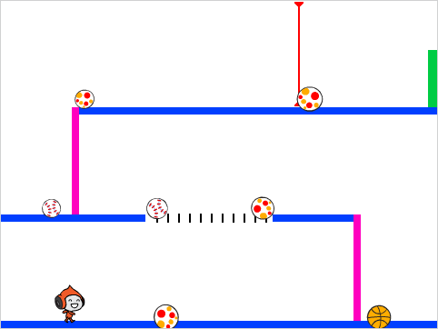

\--- no-print \---

This is the **Scratch 3** version of the project. There is also a [Scratch 2 version of the project](https://projects.raspberrypi.org/en/projects/dodgeball-scratch2).

\--- /no-print \---

## المقدمة

You'll learn how to create a platform game in which the player has to dodge moving balls to reach the end of the level.

\--- no-print \---

Click the green flag to start, and then use the arrow keys to move and the <kbd>space</kbd> key to jump.

  <iframe allowtransparency="true" width="485" height="402" src="https://scratch.mit.edu/projects/embed/251809924/?autostart=false" frameborder="0" scrolling="no"></iframe>
  

\--- /no-print \---

\--- print-only \---

\--- /print-only \---

\--- collapse \---

* * *

## title: ما ستحتاج إليه

### الأجهزة

+ جهاز كمبيوتر يدعم تشغيل برنامج Scratch 3

### البرمجيات

+ برنامج Scratch 3 (سواء كان [عبر الإنترنت](https://scratch.mit.edu/projects/editor/) أو [دون اتصال بالإنترنت](https://scratch.mit.edu/download/))

### Downloads

You can [find the downloads here](http://rpf.io/p/en/dodgeball-go).

\--- /collapse \---

\--- collapse \---

* * *

## title: ما الذي ستتعلمه

+ How to use the keyboard to control a sprite
+ How to use the `if, then, else`{:class="block3control"} Scratch block
+ How to clone a sprite

\--- /collapse \---

\--- collapse \---

* * *

## title: Additional notes for educators

\--- no-print \---

إذا كنت بحاجة إلى طباعة هذا المشروع، فالرجاء استخدام [نسخة متوافقة مع الطابعة](https://projects.raspberrypi.org/en/projects/dodgeball/print){:target="_blank"}.

\--- /no-print \---

If you need the solution to this project, [you can find it here](http://rpf.io/p/en/dodgeball-get).

\--- /collapse \---