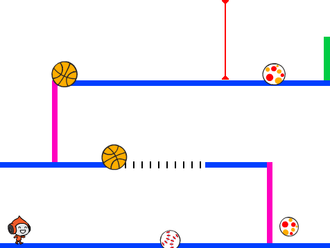

\--- no-print \---

هذا هو إصدار ** Scratch 3 ** من المشروع. هناك أيضًا [ إصدار Scratch 2 للمشروع ](https://projects.raspberrypi.org/en/projects/dodgeball-scratch2).

\--- /no-print \---

## المقدمة

سوف تتعلم كيفية إنشاء برنامج لعبة. حيث يجب على اللاعب تفادي (او مراوغة) الكرات المتحركة للوصول إلى خط النهاية.

\--- no-print \---

انقر على العلم الأخضر للبدء ، ثم استخدم مفاتيح الأسهم للتحرك و مفتاح <kbd>المسافة </kbd> للقفز.

  <iframe allowtransparency="true" width="485" height="402" src="https://scratch.mit.edu/projects/embed/251809924/?autostart=false" frameborder="0" scrolling="no"></iframe>
  

\--- /no-print \---

\--- print-only \---

\--- /print-only \---

## \--- collapse \---

## title: ما الذي ستحتاجه

### الأجهزة

+ جهاز كمبيوتر يدعم تشغيل برنامج Scratch 3

### البرمجيات

+ برنامج Scratch 3 (سواء كان [عبر الإنترنت](https://scratch.mit.edu/projects/editor/) أو [دون اتصال بالإنترنت](https://scratch.mit.edu/download/))

### للتحميل

You can [find the downloads here](https://rpf.io/p/en/dodgeball-go).

\--- /collapse \---

## \--- collapse \---

## title: ما الذي ستتعلمه

+ كيفية استخدام لوحة المفاتيح للتحكم في كائن
+ كيف تستخدم الكتل البرمجية في سكراتش `if, then, else`{:class="block3control"}
+ كيفية استنساخ كائن

\--- /collapse \---

## \--- collapse \---

## title: ملاحظات إضافية للمعلمين

\--- no-print \---

إذا كنت بحاجة إلى طباعة هذا المشروع ، فالرجاء استخدام الإصدار [الملائم للطابعة](https://projects.raspberrypi.org/en/projects/dodgeball/print){:target="_blank"}.

\--- /no-print \---

You can find the [completed project here](https://rpf.io/p/en/dodgeball-get).

\--- /collapse \---