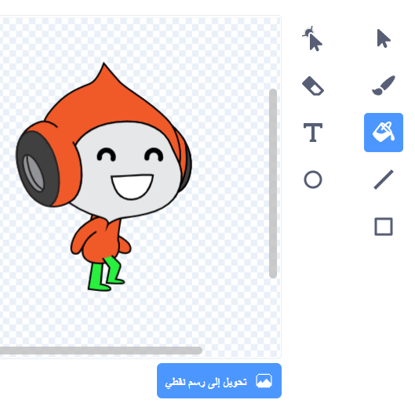

## التحدي: تحسين الجاذبية

يوجد خطأ بسيط آخر في لعبتك: الجاذبية لا تسحب الشخصية إلى أسفل إذا كان **أي** جزء من الشخصية يلامس منصة زرقاء - حتى لو كان هذا الجزء هو الرأس. حتى لو كان رأس الكائن يلامس المنصة، فإن الكائن لا يسقط! يمكنك اختبار هذا بنفسك: اجعل شخصيتك تتسلق معظم طريق السلم صعودًا ، ثم حرك الشخصية بشكل جانبي أسفل منصة:


لإصلاح الخطأ، تحتاج أولاً إلى إعطاء الكائن الخاص بك سراويل جديدة ذات لون مختلف (على **جميع **المظاهر).



ثم استبدل هذه الكتلة البرمجية:

```blocks3
    <ملامس للون [#0000FF] ؟ >
```

مع هذه الكتلة البرمجية:

```blocks3
    <اللون [#00FF00] يلامس اللون [#0000FF] ؟ >
```

للتأكد من أنك قمت بإصلاح الخطأ، اختبر اللعبة بعد إجراء هذه التغييرات!