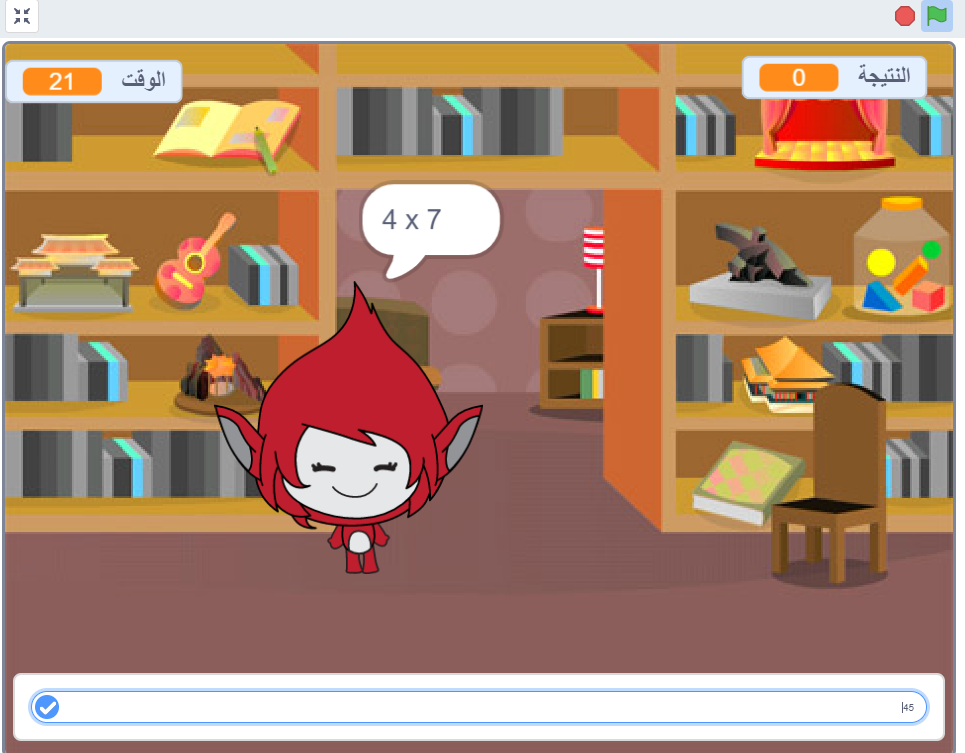

## ماذا بعد؟

اذهب إلى مشروعنا [لعبة العقل](https://projects.raspberrypi.org/ar-SA/projects/brain-game?utm_source=pathway&utm_medium=whatnext&utm_campaign=projects)، حيث يمكنك إنشاء مسابقة الرياضيات الخاصة بك.

--- no-print ---

انقر على الزر للبدء. اكتب إجابة السؤال، ثم اضغط على مفتاح <kbd>Enter</kbd>.

  <iframe allowtransparency="true" width="485" height="402" src="https://scratch.mit.edu/projects/embed/407320135/?autostart=false" frameborder="0" scrolling="no"></iframe>
  

--- /no-print ---

--- print-only ---

--- /print-only ---

***
تمت ترجمة هذا المشروع بواسطة متطوعين:

رائد موسى الجعفري

زهراء عبدالرزاق مصيخ

عبدالعزيز عبدالله الفائز

هند إبراهيم الداود

بفضل المتطوعين ، يمكننا إعطاء الناس في جميع أنحاء العالم فرصة للتعلم بلغتهم الخاصة. يمكنك مساعدتنا في الوصول إلى المزيد من الأشخاص من خلال التطوع للترجمة - مزيد من المعلومات على [rpf.io/translate](https://rpf.io/translate).