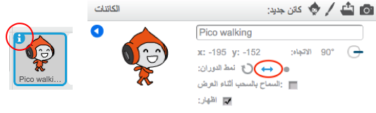

## حركة الشخصية

لنبدأ بإضافة شخصية يمكنها أن تتحرك إلى اليسار وإلى اليمين، وتصعد السلالم.

+ افتح مشروع Scratch التالي "Dodgeball" عبر الإنترنت على <a href="http://jumpto.cc/dodge-go" target="_blank">jumpto.cc/dodge-go</a> أو تحميله من <a href="http://jumpto.cc/dodge-get" target="_blank">jumpto.cc/dodge-get</a> ثم افتحه إذا كنت تستخدم المحرر دون اتصال.
    
    يحتوي المشروع على خلفية ذات منصات:
    
    

+ أضف كائنًا جديدًا ليكون الشخصية المُستخدمة في اللعبة. ومن الأفضل أن تختار كائنًا له مظاهر متعددة، بحيث يمكنك أن تجعله يبدو وكأنه يمشي.
    
    

+ لنستخدم مفاتيح الأسهم لتحريك الشخصية في كل مكان. فعندما يضغط اللاعب على مفتاح السهم اليمين، ستحتاج إلى توجيه الشخصية نحو اليمين وتحريكها بعض الخطوات وتغيير مظهرها إلى المظهر التالي:
    
    ```blocks
        عند نقر ⚑
    كرر باستمرار 
      إذا <مفتاح [السهم الأيمن v] مضغوط؟ > then
    اتجه نحو الاتجاه (90 v)
    تحرك (3) خطوات
    المظهر التالي
    end
    end
    ```

+ اختبر الشخصية بالنقر فوق العلم ثم الضغط مطوَّلًا على مفتاح السهم اليمين. هل تتحرك الشخصية إلى اليمين؟ هل تبدو الشخصية وكأنها تمشي؟
    
    

+ لتحريك الشخصية إلى اليسار، ستحتاج إلى إضافة قالب `if`{:class="blockcontrol"} أخرى داخل حلقة `كرِّر باستمرار`{:class="blockcontrol"}، بحيث تؤدي إلى تحريك الشخصية إلى اليسار.

+ اختبر التعليمة البرمجية الجديدة لتتأكد من أنها تعمل بالشكل المطلوب. هل تنقلب الشخصية عندما تسير ناحية اليسار؟
    
    
    
    إذا كان الأمر كذلك، فيمكنك إصلاح هذا الخطأ بالنقر فوق أيقونة `(i)`{:class="blocksensing"} الموجودة على كائن الشخصية، ثم النقر فوق السهم إلى اليسار-اليمين.
    
    
    
    أو يمكنك إضافة هذه التعليمة البرمجية في بداية النص البرمجي للشخصية إذا كنتَ تفضل ذلك:
    
    ```scratch
    اجعل نمط الدوران [يمين - يسار v]
    ```

+ لصعود السلم الزهري، يجب أن تتحرك الشخصية إلى الأعلى مسافة قصيرة عند الضغط على مفتاح السهم العلوي وكانت الشخصية تلامس اللون الصحيح. أضف هذه التعليمة البرمجية داخل حلقة `كرِّر باستمرار`{:class="blockcontrol"} الخاصة بالشخصية:
    
    ```blocks
        إذا <<مفتاح [السهم العلوي v] مضغوط؟> و <ملامس للون [#FF69B4] ؟>> 
      غيِّر الموضع ص بمقدار (4)
    end
    ```

+ اختبر الشخصية - هل يمكنك تسلُق السلم الزهري و الوصول إلى نهاية المستوى؟
    
    