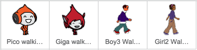

## حركة الشخصية(او الكائن)

ابدأ بإنشاء شخصية او كائن يمكنه التحرك لليسار واليمين، ويمكنه أن يتسلق السلالم ايضا.

--- task ---

افتح مشروع سكراتش مبدئي 'تفادي الكرات'.

**بالاتصال بالانترنت**: افتح المشروع المبدئي من هنا [rpf.io/dodgeball-on](https://rpf.io/dodgeball-on){:target="_blank"}.

اذا كنت تملك حساب على منصة السكراتش (Scratch) فيمكنك عمل نسخة بالضغط على **Remix**.

**دون اتصال انترنيت:** قم بتنزيل المشروع المبدئي من [rpf.io/p/ar-SA/dodgeballget](https://rpf.io/p/ar-SA/dodgeball-get) ثم قم بفتحه باستخدام محرر سكراتش بدون اتصال انترنيت.

--- /task ---

يحتوي المشروع على خلفية مع المنصات:


--- task ---

اختر كائن جديد ليكون الشخصية التي سيتحكم فيها اللاعب، وإضفه إلى مشروعك. من الأفضل أن تختار كائنا له مظاهر متعددة، بحيث يمكنك جعله يبدو كما لو أنه يمشي.



[[[generic-scratch3-sprite-from-library]]]

--- /task ---

--- task ---

أضف كتل التعليمات البرمجية إلى كائن الشخصية الخاص بك حتى يتمكن اللاعب من استخدام مفاتيح الأسهم لتحريك او التحكم بالشخصية. عندما يضغط اللاعب على السهم الأيمن، يجب على الشخصية أن تشير إلى اليمين، تحرك بضع خطوات، وغير المظهر إلى المظهر التالي:


```blocks3
when flag clicked
forever
    if <key (right arrow v) pressed? > then
        point in direction (90 v)
        move (3) steps
        next costume
    end
end
```

--- /task ---

--- task ---

إذا لم يكن حجم الكائن مناسبا ، قم بضبط حجمه.


--- /task ---

--- task ---

اختبر الشخصية بالنقر فوق العلم ثم الضغط مطوَّلًا على مفتاح السهم اليمين. هل تتحرك الشخصية إلى اليمين؟ هل تبدو شخصيتك وكأنها تمشي ؟


--- /task ---

--- task ---

أضف كتل التعليمات البرمجية إلى الكائن حلقة تكرار `للأبد`{:class="block3control"} بحيث تمشي إلى اليسار إذا تم الضغط على مفتاح السهم الأيسر.

--- hints ---


--- hint ---

حتى تتمكن شخصيتك من الانتقال إلى اليسار، ستحتاج إلى إضافة كتلة أخرى `إذا `{:class="block3control"} داخل حلقة تكرار `للأبد`{:class="block3control"}. في هذه الكتلة الجديدة `if`{:class="block3control"}، أضف تعليمة برمجية لجعل الكائن او شخصيتك `يتحرك `{:class="block3motion"} إلى اليسار.

--- /hint ---

--- hint ---

إنسخ التعليمة البرمجية التي أنشأتها لجعل الشخصية تمشي إلى اليمين. ثم قم بضبط `المفتاح مضغوط`{:class="block3sensing"} إلى `السهم الأيسر `{:class="block3sensing"}، وغير `الاتجاه`{:class="block3motion"} إلى `-90`.

```blocks3
if <key (right arrow v) pressed? > then
    point in direction (90 v)
    move (3) steps
    next costume
end
```

--- /hint ---

--- hint ---

يجب أن تبدو التعليمات البرمجية خاصتك بالشكل التالي:


```blocks3
when green flag clicked
forever 
  if <key (right arrow v) pressed?> then 
    point in direction (90 v)
    move (3) steps
    next costume
  end
  if <key (left arrow v) pressed?> then 
    point in direction (-90 v)
    move (3) steps
    next costume
  end
end
```

--- /hint ---

--- /hints ---

--- /task ---

--- task ---

اختبر التعليمة البرمجية الجديدة لتتأكد من أنها تعمل بالشكل المطلوب. هل تنقلب شخصيتك رأسًا على عقب عند المشي إلى اليسار؟


إذا كان الأمر كذلك، يمكنك إصلاح هذا عن طريق النقر على **الاتجاه** لشخصية الكائن الخاص بك، ثم النقر على السهم اليسار-اليمين.


أو إذا كنت تفضل ، يمكنك أيضا إصلاح المشكلة عن طريق إضافة هذه الكتلة البرمجية إلى بداية البرنامج للشخصية الخاصة بك:

```blocks3
set rotation style [left-right v]
```

--- /task ---

--- task ---

لتسلق السلم الوردي، يجب أن يتحرك الكائن بضع خطوات إلى الأعلى على المنصة كلما تم الضغط على السهم إلى الأعلى و تلمس الشخصية اللون الصحيح.

أضف داخل حلقة `التكرار `{:class="block3control"} الخاصة بالكائن `لتغيير `{:class="block3motion"} موضع الكائن `y` (العمودي) `إذا `{:class="block3control"} تم الضغط على `السهم للأعلى `{:class="block3sensing"} و الكائن `لمس اللون الوردي`{:class="block3sensing"}.


```blocks3
    if < <key (up arrow v) pressed?> and <touching color [#FF69B4]?> > then
        change y by (4)
    end
```

--- /task ---

--- task ---

اختبر مشروعك. هل يمكنك جعل الشخصية تتسلق السلم الوردي وتصل إلى نهاية المستوى؟


--- /task ---
