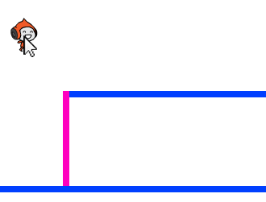

## الجاذبية و القفز

لنجعل الشخصية تتحرك بشكل أكثر واقعية، وذلك عن طريق إضافة الجاذبية والسماح للشخصية بالقفز.

+ ربما لاحظتَ أن الشخصية تسير في الهواء عند مغادرة المنصة. جرِّب أن تغادر المنصة ولاحظ ما يحدث.
    
    

+ لإصلاح ذلك، لنضِف الجاذبية إلى اللعبة. أنشئ متغيرًا جديدًا يُسمى الجاذبية `gravity`{:class="blockdata"}. يمكنك إخفاء هذا المتغير من منصة أو مساحة العمل إذا أردت.
    
    

+ أضف التعليمة البرمجية الجديدة هذه، والتي ستعطي متغير الجاذبية قيمة سالبة، ثم تستخدمه لتغيير الإحداثي y للشخصية بشكل متكرِّر.
    
    ```blocks
        عند نقر ⚑
    اجعل [gravity v] مساوياً [-4]
    كرر باستمرار 
      غيِّر الموضع ص بمقدار (gravity)
    end
    ```

+ انقر فوق العلم، ثم اسحب الشخصية إلى أعلى المنصة. ماذا حدث؟ هل تعمل الجاذبية كما توقعت؟
    
    

+ الجاذبية يجب أن لا تسمح للشخصية بالتحرك على المنصة أو صعود السلم! لذا أضف التعليمة البرمجية `if`{:class="blockcontrol"} إلى بقية التعليمات، بحيث تعمل الجاذبية فقط عندما تكون الشخصية في الهواء. يجب أن تكون التعليمة البرمجية للجاذبية كما يلي:
    
    ```blocks
        عند نقر ⚑
    اجعل [gravity v] مساوياً [-4]
    كرر باستمرار 
      إذا <ليس <<ملامس للون [#0000FF] ؟> أو <ملامس للون [#FF69B4] ؟>>> 
        غيِّر الموضع ص بمقدار (gravity)
      end
    end
    ```

+ اختبر الجاذبية مرة أخرى. هل تتوقف الشخصية عندما تكون على منصة أو سلم؟ هل تسقط الشخصية إلى المستوى الأدنى عند الوصول إلى حواف المنصات؟
    
    

+ لنجعل الشخصية تقفز أيضًا عندما يضغط اللاعب على مفتاح المسافة. توجد طريقة سهلة جدًا لفعل ذلك، وهي تحريك الشخصية إلى الأعلى عدة مرات باستخدام التعليمة البرمجية التالية:
    
    ```blocks
        عند ضغط مفتاح [المسافة v]
    كرِّر (10) مرة 
      غيِّر الموضع ص بمقدار (4)
    end
    ```
    
    لأن الجاذبية تسحب الشخصية إلى أسفل بمقدار 4 بكسل باستمرار، ستحتاج إلى اختيار رقم أكبر من 4 في التعليمة البرمجية `غيِّر الموضع ص بمقدار (4)`{:class="blockmotion"}. غيِّر هذا الرقم حتى تحصل على ارتفاع القفزة الذي تريده للشخصية.

+ إذا اختبرت هذه التعليمة البرمجية، فستلاحظ أنها تعمل بالشكل المطلوب، لكن الحركة ليست سلسة. لتجعل حركة القفز سلسة، ستحتاج إلى تحريك الشخصية بقيم أقل فأقل حتى تصل القفزة إلى نهايتها.

+ لتفعل ذلك، أنشئ متغيرًا آخر يُسمى `jump height`{:class="blockdata"}. ويمكنك إخفاء هذا المتغير أيضًا إذا أردت.

+ احذف التعليمة البرمجية الخاصة بالقفز التي أضفتها إلى الشخصية، واستخدم هذه التعليمة البرمجية بدلًا منها:
    
    ```blocks
        عند ضغط مفتاح [المسافة v]
    اجعل [jump height v] مساوياً [8]
    كرِّر حتى <(jump height) = [0]> 
      غيِّر الموضع ص بمقدار (jump height)
      غيِّر [jump height v] بمقدار (-0.5)
    end
    ```
    
    ستحرِّك هذه التعليمةُ البرمجية شخصيتَك بمقدار 8 بكسل، ثم 7.5 بكسل، ثم 7 بكسل، وهكذا حتى تصل قفزة الشخصية إلى نهايتها. وبذلك ستبدو القفزة اكثر سلاسة.

+ غيِّر القيمة التي يبدأ بها المتغير `jump height`{:class="blockdata"} واختبر هذا المتغير إلى أن تحصل على ارتفاع القفزة الذي تريده للشخصية.