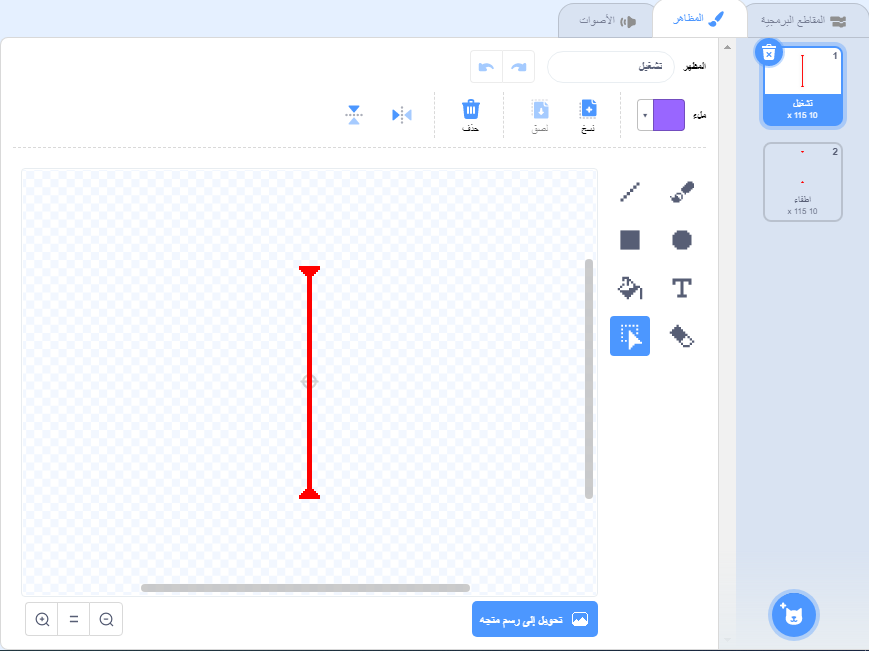
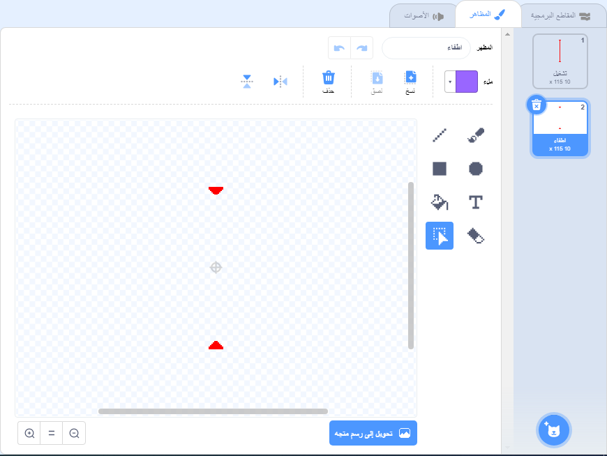

## أشعة الليزر!

لجعل اللعبة الخاصة بك اصعب قليلاً، ستضيف اليها أشعة الليزر!

--- task ---

أضف كائن جديد إلى لعبتك وسَمِّهِ `ليزر`. ويجب أن يكون لهذا الكائن مظهران، أحدهما 'تشغيل' والآخر 'إيقاف'.





--- /task ---

--- task ---

ضَع كائن شعاع الليزر الجديد في أي مكان تختاره بين منصتين.


--- /task ---

--- task ---

أضف تعليمة برمجية إلى كائن الليزر الخاص بك لجعله يتغير بين المظهرين.


```blocks3
    when flag clicked
    forever
        switch costume to (تشغيل v)
        wait (2) seconds
        switch costume to (اطفاء v)
        wait (2) seconds
    end
```

إذا اردت، يمكنك تغيير التعليمة البرمجية الموضحة أعلاه بحيث `ينتظر`{:class="block3control"} الكائن فترة `عشوائية`{:class="block3operators"} من الزمن بين تغيير المظهر.

--- /task ---

--- task ---

وأخيرا، أضف تعليمة برمجية إلى كائن الليزر بحيث يقوم كائن الليزر ببث رسالة 'ضرب' عندما يلمس كائن الشخصية.

--- hints ---


--- hint ---

يجب أن تكون هذه التعليمات البرمجية مشابهة جداً للتعليمات البرمجية التي أضفتها إلى كائن الكرة الخاص بك.

--- /hint ---

--- hint ---

انسخ التعليمات البرمجية التي تضيفها إلى كائن الكرة لجعل هذا الكائن `يبث 'ضرب'`{:class="block3control"} عندما `يلمس شخصيتك `{:class="block3sensing"}.

--- /hint ---

--- hint ---

هذا هي التعليمة البرمجية التي يجب أن تضيفها:


```blocks3
when green flag clicked
forever 
  if <touching (Pico walking v) ?> then 
    broadcast (ضربة v)
  end
end
```

--- /hint ---

--- /hints ---

لا تحتاج إلى إضافة أي تعليمات برمجية إضافية إلى الكائن، لأن الكائن يعرف بالفعل ما يجب فعله عندما يتلقى `بث 'ضرب'`{:class="block3control"}!

--- /task ---

--- task ---

اختبر لعبتك لمعرفة ما إذا كنت تستطيع تحريك الشخصية بعد الليزر. إذا كان تجنب الليزر سهلًا جدًا أو صعباً جدًا، غير اوقات `الانتظار `{:class="block3control"} في التعليمات البرمجية لكائن الليزر.

--- /task ---