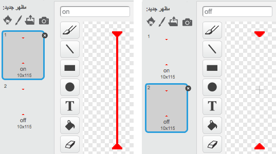

## أشعة ليزر!

لنجعل إنهاء لعبتك أكثر صعوبة بإضافة أشعة الليزر!


+ أضف كائنًا جديدًا إلى لعبتك يُسمى 'شعاع ليزر'. ويجب أن يكون لهذا الكائن مظهران، أحدهما 'تشغيل' والآخر 'إيقاف'.

	

+ ضَع كائن شعاع الليزر الجديد في أي مكان تختاره بين منصتين.

	

+ أضف تعليمة برمجية إلى شعاع الليزر لتحويله بين المظهرين.

	```blocks
		عند نقر العلم
		كرِّر باستمرار
			حوِّل المظهر إلى [تشغيل v]
			انتظر (2) ثانية
			حوِّل المظهر إلى [إيقاف v]
			انتظر (2) ثانية
		أوقف المقطع البرمجي
	```

	يمكنك `الانتظار`{:class="blockcontrol"} مدة `عشوائية`{:class="blockoperators"} من الوقت للتحوّل من مظهر إلى آخر.

+ وأخيرًا، أضف تعليمة برمجية إلى شعاع الليزر، بحيث يتم بث الرسالة 'اصطدام' عندما يلامس شعاع الليزر الشخصية. ستكون هذه التعليمة البرمجية مشابهة جدًا للتعليمة البرمجية التي أضفتَها إلى كائن الكرة.

	لن تحتاج إلى إضافة أي تعليمات برمجية أخرى إلى الشخصية - لأنها ستنفِّذ بالفعل ما يجب أن يحدث عندما تصطدم!

+ اختبر لعبتك لتلاحظ هل يمكنك اختراق شعاع الليزر أم لا. غيِّر أوقات`انتظر`{:class="blockcontrol"} في التعليمة البرمجية إذا كانت أشعة الليزر عوائق سهلة للغاية أو صعبة جدًا.

