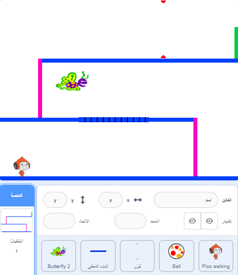

## التحدي: المزيد من العقبات (او العوائق)

إذا كنت تعتقد أن لعبتك لا تزال سهلة جداً، يمكنك إضافة المزيد من العقبات إليها. يمكن أن تكون العقبات أي شيء تريده! إليك بعض الأفكار:

+ الفراشة الخطيرة
+ المنصات التي تظهر وتختفي
+ كرات تنس طائرة يجب تفاديها



يمكنك أيضًا تصميم خلفية أخرى لإنشاء المستوى التالي. ثم أضف تعليمة برمجية بحيث عندما تصل شخصيتك إلى الباب الأخضر، تتحول اللعبة إلى الخلفية الجديدة:


```blocks3
    if <touching color [#00FF00]?> then
        switch backdrop to (next backdrop v)
        go to x: (-210) y: (-120)
        wait (1) seconds
    end
```