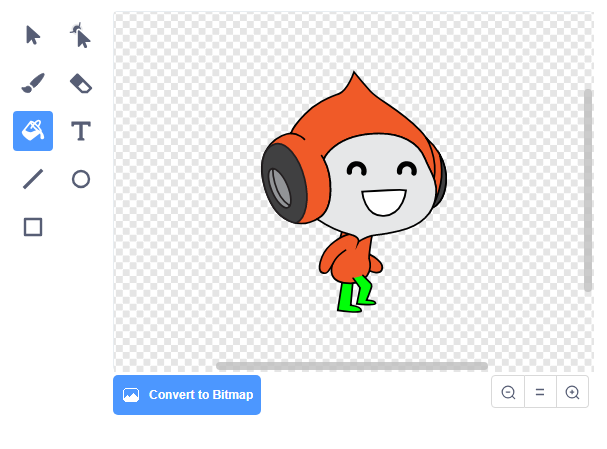

## Challenge: মাধ্যাকর্ষণ আরও উন্নত করুন

আপনার গেমটিতে আরও একটি ছোট bug রয়েছে: মাধ্যাকর্ষণ কোনও character sprite কে নীচের দিকে টানবে না যদি sprite এর কোনো/**any** অংশ নীল প্ল্যাটফর্মকে স্পর্শ করে ।. সুতরাং sprite এর মাথা একটি প্ল্যাটফর্মকে স্পর্শ করলেও sprite টি পড়বে না! আপনি নিজে এটি পরীক্ষা করে দেখতে পারেন: আপনার character টি একটি সিঁড়ি দিয়ে বেশিরভাগ পথে আরোহণ করবে এবং তারপরে character টিকে একটু পাশে প্ল্যাটফর্মের নীচে সরিয়ে নিন:


Bug টি ঠিক করার জন্য, আপনাকে প্রথমে আপনার character sprite কে নতুন কিছু trouser দিতে হবে যাতে আলাদা রঙ রয়েছে (on **all** costumes).



তারপরে এই কোড ব্লকটি প্রতিস্থাপন করুন:

```blocks3
    < touching color [#0000FF]? >
```

এই কোড ব্লক দ্বারা:

```blocks3
    < color [#00FF00] is touching [#0000FF]? >
```

আপনি bug টি ঠিক করেছেন তা নিশ্চিত করতে, এই পরিবর্তনগুলি করার পরে গেমটি পরীক্ষা করুন!