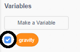
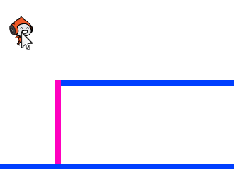

## মাধ্যাকর্ষণ এবং লাফানো

এখন আপনি আপনার character টিকে আরও বাস্তবিক ভাবে চালিত করতে যাচ্ছেন: আপনি আপনার গেমটিতে মহাকর্ষ যুক্ত করবেন এবং চরিত্রটিকে লাফ দেওয়ার ক্ষমতা দেবেন।.

\--- task \---

গেমটিতে, আপনার character টি এমনভাবে সরান যাতে এটি প্ল্যাটফর্মের বাইরে চলে যায়।. আপনি দেখতে পাচ্ছেন যে এটি খালি জায়গায় হাটতে পারে?


\--- /task \---

\--- task \---

এটি ঠিক করতে গেমটিতে মহাকর্ষ যুক্ত করুন।. ইহা করতে নতুন variable যুক্ত করুন `gravity`{:class="block3variables"}.

[[[generic-scratch3-add-variable]]]

আপনি চাইলে আপনি এই variable টি আপনার স্টেজ থেকে আড়াল করতে পারেন।.



\--- /task \---

\--- task \---

এই নতুন কোড ব্লকগুলি যোগ করুন যা `gravity` সেট করে ঋণাত্মক সংখ্যায় এবং `gravity` মানটি ব্যবহার করুন আপনার character Y- অক্ষ বারবার পরিবর্তন করতে:


```blocks3
    when flag clicked
    set [gravity v] to [-4]
    forever
        change y by (gravity)
    end
```

\--- /task \---

\--- task \---

পতাকাটিতে ক্লিক করুন, এবং তারপরে আপনার চরিত্রটিকে স্টেজের শীর্ষে টেনে আনুন ।. কি ঘটেছে? আপনার প্রত্যাশা অনুযায়ী মাধ্যাকর্ষণ কি কাজ করে?



\--- /task \---

\--- task \---

মাধ্যাকর্ষণটি কোনও প্ল্যাটফর্ম বা মই দিয়ে character sprite কে সরাতে পারবে না! একটি `if`{:class="block3control"} ব্লক কোড যুক্ত করুন যাতে character টি মধ্য বায়ুতে থাকলে মাধ্যাকর্ষণ কাজ করে।. মাধ্যাকর্ষণ কোডটি এর পরে দেখতে হবে:


```blocks3
    when flag clicked
    set [gravity v] to [-4]
    forever
        if < not < <touching color [#0000FF]?> or <touching color [#FF69B4]?> > > then
            change y by (gravity)
        end
    end
```

\--- /task \---

\--- task \---

মাধ্যাকর্ষণটি এখন সঠিকভাবে কাজ করে কিনা তা দেখতে আবার গেমটি পরীক্ষা করুন।. আপনার character sprite টি যখন প্ল্যাটফর্ম বা মইয়ের সাথে স্পর্শ করে তখন কি পড়ে যাওয়া বন্ধ হয়ে যায়? আপনি কি character টিকে প্ল্যাটফর্মের প্রান্ত থেকে দূরে ফেলতে এবং নীচের স্তরের দিকে নিয়ে যেতে পারেন?


\--- /task \---

\--- task \---

যখনই প্লেয়ার <kbd>space</kbd> key চাপবেন তখন আপনার character টিকে লাফিয়ে তোলার জন্য কোড যোগ করুন. এটি করার একটি খুব সহজ উপায় হ'ল আপনার চরিত্রটি কয়েকবার উপরে উঠানো:


```blocks3
    when [space v] key pressed
    repeat (10)
        change y by (4)
    end
```

মাধ্যাকর্ষণ ক্রমাগত আপনার character কে 4 পিক্সেল নীচে নামিয়ে দিচ্ছে, আপনাকে `4` এর চেয়ে বড় একটি সংখ্যা চয়ন করতে হবে `change y by (4)`{:class="block3motion"} এই ব্লকে. Character টির উচ্চতা নিয়ে আপনি খুশি না হওয়া পর্যন্ত নম্বরটি পরিবর্তন করুন।.

\--- /task \---

\--- task \---

আপনার কোড পরীক্ষা করুন।. লক্ষ্য করুন লাফানোটি খুব মসৃণ নয়।. লাফানোকে মসৃণ চেহারা দেওয়ার জন্য, আপনার character sprite টিকে আরও ছোট ছোট পরিমাণে স্থানান্তরিত করতে হবে, যতক্ষণ না এটি উপরে উঠছে ।.

\--- /task \---

\--- task \---

ইহা করতে নতুন variable যুক্ত করুন `jump height`{:class="block3variables"}. আবার আপনি চাইলে এই variable টি আড়াল করতে পারেন।.

\--- /task \---

\--- task \---

আপনি character sprite এ যুক্ত জাম্পিং কোডটি delete করুন এবং পরিবর্তে এই কোডটি যুক্ত করুন:


```blocks3
    when [space v] key pressed
    set [jump height v] to [8]
    repeat until < (jump height) = [0] >
        change y by (jump height)
        change [jump height v] by (-0.5)
    end
```

এই কোডটি আপনার character টিকে 8 পিক্সেল, তারপরে 7.5 পিক্সেল, তারপর 7 পিক্সেল এইভাবে উপরে নিয়ে যায়, যতক্ষণ না এটি আরো উপরে ওঠে ।. এটি লাফানোটিকে বেশ মসৃণ করে তোলে।.

\--- /task \---

\--- task \---

`jump height`{:class="block3variables"} variable এর মান পরিবর্তন করুন যাহা `repeat`{:class="block3control"} শুরু হবার আগে বসানো. তারপরে আপনার গেমটি পরীক্ষা করুন।.

Character টির লাফানোর উচ্চতা নিয়ে খুশি না হওয়া পর্যন্ত ওই দুটি পদ্ধতি পুনরাবিবৃতি করুন ।.

\--- /task \---