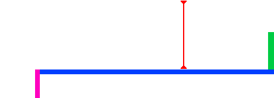

## লেজার!

গেমটি শেষ করা যাতে আরো একটু বেশি কঠিন করা যায় তার জন্য আপনি লেজার যুক্ত করতে যাচ্ছেন!

--- task ---

গেমটিতে একটি নতুন sprite যুক্ত করুন এবং এটির নাম দিন `laser`. এটিতে দুটি costume থাকতে হবে: একটিকে 'on' বলা হবে এবং অন্যটিকে বলা হবে 'off'.


--- /task ---

--- task ---

দুটি প্ল্যাটফর্মের মধ্যে আপনার নতুন লেজার sprite রাখুন।.



--- /task ---

--- task ---

আপনার লেজার sprite এ কোড যুক্ত করুন যাতে ইহা দুটি costume পরিবর্তন করতে পার।.


```blocks3
    when flag clicked
    forever
        switch costume to (on v)
        wait (2) seconds
        switch costume to (off v)
        wait (2) seconds
    end
```

যদি আপনি মনে করেন তাহলে উপরে কোডগুলো পরিবর্তন করতে পারেন যাতে sprite টি costume পরিবর্তনের মধ্যে `random`{:class="block3operators"} সময় `wait`{:class="block3control"} করতে পারে.

--- /task ---

--- task ---

এরপর আপনার লেজার sprite এ এমন কোড যুক্ত করুন যাতে লেজার sprite টি character sprite কে স্পর্শ করলে একটি 'hit' বার্তা প্রচারিত/broadcast হয়।.

--- hints ---


--- hint ---

এই কোডটির বল sprite এ যুক্ত কোডের সাথে মিল থাকা উচিত।.

--- /hint ---

--- hint ---

Sprite টি যখন `touching your character`{:class="block3sensing"} হবে তখন `broadcast 'hit'`{:class="block3control"} সম্প্রচার করার জন্য কোডটি কপি করে বল sprite এ যুক্ত করুন.

--- /hint ---

--- hint ---

এই কোডটি আপনাকে যুক্ত করা উচিত:


```blocks3
when green flag clicked
forever 
  if <touching (Pico walking v) ?> then 
    broadcast (hit v)
  end
end
```

--- /hint ---

--- /hints ---

Character sprite এ আপনাকে কোনও অতিরিক্ত কোড যুক্ত করার দরকার নেই, কারণ Character sprite টি ইতিমধ্যে জেনে গেছে যখন এটি `broadcast 'hit'`{:class="block3control"} পাবে তখন কি করতে হবে!

--- /task ---

--- task ---

গেমটি পরীক্ষা করে দেখুন যে আপনি লেজারের পাশ দিয়ে character টির স্থানান্তর করতে পারছেন কিনা।. যদি লেজারটি এড়ানো খুব সহজ বা খুব কঠিন হয় তবে লেজার sprite এর `wait`{:class="block3control"} এর সময় পরিবর্তন করতে কোড যুক্ত করুন.

--- /task ---