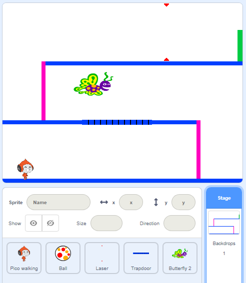

## Challenge: আরও বেশি বাধা

আপনি যদি মনে করেন গেমটি এখনও খুব সহজ, আপনি এতে আরও বেশি বাধা যুক্ত করতে পারেন।. বাধাগুলি আপনার পছন্দ মতো যা কিছু হতে পারে! এখানে কিছু ধারনা দেওয়া হলো:

+ একটি বিপজ্জনক প্রজাপতি
+ এমন কিছু প্ল্যাটফর্ম যা প্রদর্শিত হয় এবং আবার অদৃশ্য হয়ে যায়
+ এমন কিছু টেনিস বল পড়ছে যেগুলো এড়িয়ে এগিয়ে যাওয়া যায়



এমনকি আপনি পরবর্তী স্তর তৈরি করতে অন্য একটি ব্যাকড্রপ বানাতে পারেন।. তারপরে কোড যুক্ত করুন যাতে আপনার character টি সবুজ দরজায় পৌঁছালে গেমটি নতুন পর্যায়ে চলে যায়:


```blocks3
    if <touching color [#00FF00]?> then
        switch backdrop to (next backdrop v)
        go to x: (-210) y: (-120)
        wait (1) seconds
    end
```