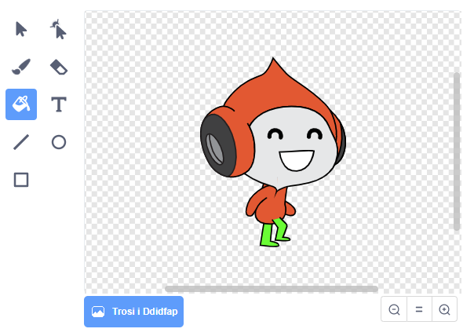

## Her: gwell disgyrchiant

Mae ‘na un broblem fach arall yn dy gêm: dyw’r disgyrchiant ddim yn tynnu dy gymeriad lawr **os** yw unrhyw ran ohono yn cyffwrdd y platfform glas. Felly os yw pen y corlun yn cyffwrdd y platfform, ni fydd yn cwympo! Mae modd profi hyn trwy ddringo rhan fwyaf o’r ffordd fyny’r ysgol ac yna symud i’r chwith o dan y platfform:


I drwsio hyn, bydd angen i ti roi trowsus lliw gwahanol i dy gymeriad (i **bob** gwisg).



Yna newid y bloc côd yma:

```blocks3
    < cyffwrdd lliw [#0000FF]? >
```

gyda'r bloc côd yma:

```blocks3
    < lliw [#00FF00] yn cyffwrdd [#0000FF]? >
```

Cofia brofi dy gêm i wneud yn siwr ei fod wedi ei drwsio!