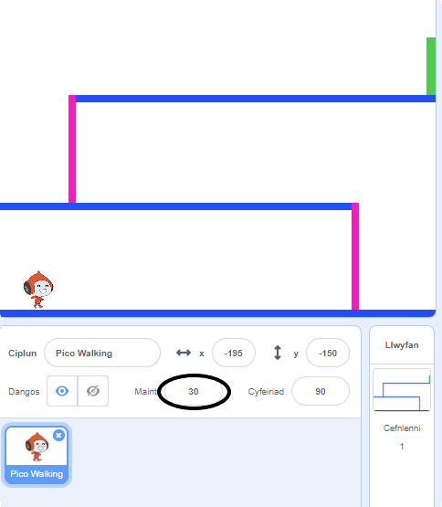
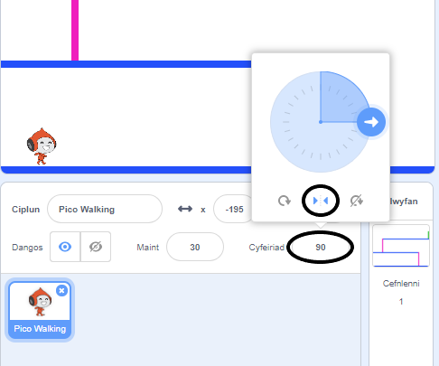

## Symudiad y cymeriad

Dechreua drwy greu cymeriad a all symud i'r chwith ac i'r dde, a gall ddringo i fyny ysgolion.

\--- task \---

Agora y prosiect cychwynnol Scratch 'Osgoi'r bêl'.

**Arlein:** agora brosiect Scratch newydd yma [rpf.io/dodgeball-on](http://rpf.io/dodgeball-on){:target="_blank"}.

Os oes ganddot ti gyfrif Scratch galli di wneud copi drwy glicio ar ** Remix **.

** All-lein: ** lawrlwytha'r prosiect cychwynnol o [ rpf.io/p/en/dodgeball-get ](http://rpf.io/p/en/dodgeball-get) ac yna ei agor gan ddefnyddio'r golygydd all-lein.

\--- /task \---

Mae'r prosiect yn cynnwys cefndir gyda llwyfannau:


\--- task \---

Dewisa gorlun newydd fel y cymeriad y bydd y chwaraewr yn ei reoli, a'i ychwanegu at eich prosiect. Mae'n well os wyt ti'n dewis corlun gyda gwisgoedd lluosog, fel y galli di wneud iddo edrych fel petai'n cerdded.


[[[generic-scratch3-sprite-from-library]]]

\--- /task \---

\--- task \---

Ychwanega flociau côd i dy gymeriad fel bod y chwareuwr yn gallu defnyddio'r bysellau saeth i symud y cymeriad o gwmpas. Pan fydd y chwaraewr yn gwasgu'r saeth dde, dylai'r cymeriad bwyntio i'r dde, symud ychydig o risiau, a newid i'r wisg nesaf:


```blocks3
pan fo'r flag werdd yn cael ei glicio
am byth 
  os <bysell (right arrow v) wedi ei phwyso? > yna 
    pwyntio i gyfeiriad (90 v)
    symud (3) cam
    gwisg nesaf
  end
end
```

\--- /task \---

\--- task \---

Os nad yw'r corlun yn ffitio, addasa ei faint.



\--- /task \---

\--- task \---

Profa dy gymeriad drwy glicio ar y faner ac yna dal y fysell dde i lawr. Ydy dy gymeriad yn symud i'r dde? Ydy dy gymeriad yn edrych fel ei fod yn cerdded?


\--- /task \---

\--- task \---

Ychwanega blociau côd i ddolen `am byth`{:class="block3control"} dy gorlun, fel ei fod yn cerdded i'r chwith pan fo'r saeth chwith yn cael ei gwasgu.

\--- hints \---

\--- hint \---

Fel bod y cymeriad yn gallu symud i'r chwith, bydd angen ychwanegu bloc arall `os`{:class="block3control"} o fewn y ddolen `am byth`{:class="block3control"}. Yn y bloc newydd `os`{:class="block3control"} ychwanega gôd i wneud i dy gorlun `symud`{:class="block3motion"} i'r chwith.

\--- /hint \---

\--- hint \---

Copïa'r côd rwyt ti wedi ei greu i wneud i'r cymeriad gerdded i'r dde. Yna gosoda yr `bysell wedi ei wasgu`{:class="block3sensing"} i'r `chwith`{:class="block3sensing"}, a newid `cyfeiriad`{:class="block3motion"} i `-90`.

```blocks3
os <bysell (right arrow v) wedi ei phwyso? > yna 
  pwyntio i gyfeiriad (90 v)
  symud (3) cam
  gwisg nesaf
end
```

\--- /hint \---

\--- hint \---

Fe ddylai dy gôd edrych fel hyn:


```blocks3
pan fo'r flag werdd yn cael ei glicio
am byth 
  os <bysell (right arrow v) wedi ei phwyso?> yna 
    pwyntio i gyfeiriad (90 v)
    symud (3) cam
    gwisg nesaf
  end
  os <bysell (left arrow v) wedi ei phwyso?> yna 
    pwyntio i gyfeiriad (-90 v)
    symud (3) cam
    gwisg nesaf
  end
end
```

\--- /hint \---

\--- /hints \---

\--- /task \---

\--- task \---

Profa dy gôd newydd i sicrhau ei fod yn gweithio. Ydy dy gymeriad yn troi wyneb i waered wrth gerdded i'r chwith?


Os felly, fe alli di drwsio hyn trwy glicio y **cyfeiriad** ar gymeriad dy giplun, ac yn clicio y saeth chwith-dde.



Neu, os oes well gyda ti ychwanegu y bloc yma i ddechrau sgript dy gymeriad:

```blocks3
gosod steil cylchdroi [left-right v]
```

\--- /task \---

\--- task \---

I ddringo’r ysgol binc, fe ddylai’r cymeriad symud ychydig yn uwch bob tro mae’r saeth fyny yn cael ei wasgu **ac** mae’n cyffwrdd y lliw cywir.

Ychwanega o fewn y ddolen `am byth`{:class="block3control"} i `newid`{:class="block3motion"} safle `y` y cymeriad `os`{:class="block3control"} yw `bysell y saeth i fyny wedi ei gwasgu`{:class="block3sensing"} a bod y cymeriad yn `cyffwrdd y lliw pinc`{:class="block3sensing"}.


```blocks3
    os <<bysell (up arrow v) wedi ei phwyso?> a <cyffwrdd lliw [#FF69B4] ?>> yna 
  newid y gan (4)
end
```

\--- /task \---

\--- task \---

Rhowch brawf ar eich cod. Alli di wneud i'r cymeriad ddringo'r ysgolion pinc a chyrraedd diwedd y lefel?


\--- /task \---