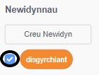

## Disgyrchiant a neidio

Nawr rwyt ti am wneud dy gymeriad i symud yn fwy realistig, wrth ychwanegu disgyrchiant i'r gêm a gadael i'r cymeriad allu neidio.

--- task ---

Yn y gêm, ceisia gerdded dy gymeriad i ffwrdd o’r platfform. Alli di ei weld e'n cerdded i le gwag?


--- /task ---

--- task ---

I drwsio hyn, ychwanega ddisgyrchiant i dy gêm. I wneud hyn, byddwn yn creu newidyn newydd o'r enw `disgyrchiant`{:class="block3variables"}.

[[[generic-scratch3-add-variable]]]

Mae modd i ti guddio’r newidyn yma o’r llwyfan os wyt ti eisiau.



--- /task ---

--- task ---

Ychwanega’r bloc côd yma, sydd yn gosod y `disgyrchiant` i rif negatif ac yna yn defnyddio hyn i newid cyfesur-y y cymeriad:


```blocks3
    pan fo'r flag werdd yn cael ei glicio
gosod [disgyrchiant v] i [-4]
am byth 
  newid y gan (disgyrchiant)
end
```

--- /task ---

--- task ---

Clicia’r faner a llusga’r cymeriad i dop y llwyfan. Beth sy'n digwydd? Ydy’r disgyrchiant yn gweithio fel oeddet ti’n ei ddisgwyl?


--- /task ---

--- task ---

Ni ddylai disgyrchiant symud dy gymeriad trwy blatfform neu ysgol! Ychwanega bloc `os`{:class="block3control"} i dy gôd, fel bod y disgyrchiant ond yn gweithio pan mae’r cymeriad yn yr aer. Fe ddylai côd y disgyrchiant edrych fel hyn:


```blocks3
    pan fo'r flag werdd yn cael ei glicio
gosod [disgyrchiant v] i [-4]
am byth 
  os <nid <<cyffwrdd lliw [#0000FF] ?> neu <cyffwrdd lliw [#FF69B4] ?>>> yna 
    newid y gan (disgyrchiant)
  end
end

disgyrchiant
```

--- /task ---

--- task ---

Profa dy gêm eto i weld a yw'r disgyrchiant yn gweithio'n gywir nawr. Ydy dy gymeriad yn stopio pan mae ar blatfform neu ysgol? Wyt ti’n gallu cerdded oddi ar ochr y platfform i’r lefel is?


--- /task ---

--- task ---

Fe wnawn ni hefyd wneud i dy gymeriad neidio pan mae’r chwareuwr yn gwasgu’r <kbd>bylchwr</kbd>. Un ffordd syml iawn o wneud hyn yw symud dy gymeriad fyny ychydig o weithiau:


```blocks3
    pan fo bysell [bwlch v] wedi ei wasgu
ailadrodd (10) 
  newid y gan (4)
end
```

Gan fod disgyrchiant yn gyson yn gwthio dy gymeriad i lawr 4 picsel, mae angen i ti ddewis rhif yn fwy na `4` yn dy floc `newid y gan (4)`{:class="block3motion"}. Newida’r rhif yma tan dy fod yn hapus gyda uchder neidio dy gymeriad.

--- /task ---

--- task ---

Profa dy gôd. Sylwa nad yw'r symudiad neidio yn llyfn iawn. I wneud i'r neidio edrych yn fwy llyfn, bydd angen i ti symud dy gymeriad llai a llai, tan nad yw’n neidio rhagor.

--- /task ---

--- task ---

I wneud hyn, bydd angen creu newidyn arall o’r enw `uchder neidio`{:class="block3variables"}. Eto, mae modd newid y newidyn yma os oes well gyda ti.

--- /task ---

--- task ---

Dileua’r côd neidio wnes di ychwanegu i dy gymeriad, a gosod y côd yma yn ei le:


```blocks3
    pan fo bysell [bwlch v] wedi ei wasgu
gosod [uchder neidio v] i [8]
ailadrodd hyd at <(uchder neidio) = [0]> 
  newid y gan (uchder neidio)
  newid [uchder neidio v] gan (-0.5)
end
```

Mae’r côd yma yn symud dy gymeriad fyny wrth 8 picsel, yna 7.5 picsel, yna 7 picsel, ac ati, tan fod dy gymeriad wedi gorffen neidio. Mae hyn yn gwneud i’r neidio edrych yn llawer llyfnach.

--- /task ---

--- task ---

Newida gwerth dechrau y newidyn `uchder neidio`{:class="block3variables"} a'i osod cyn i'r `ail-adrodd`{:class="block3control"} gychwyn. Yna profa dy gêm.

Ail-adrodda'r camau yma tan dy fod yn hapus gydag uchder neidio dy gymeriad.

--- /task ---