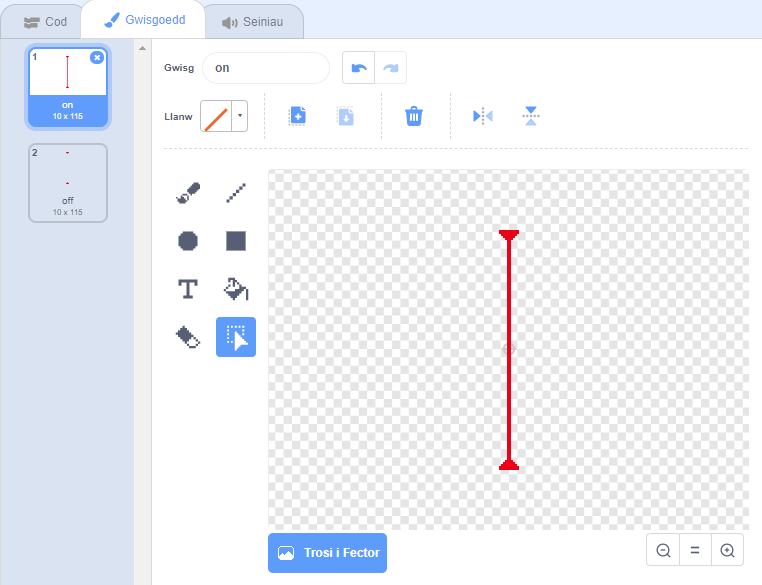

## Laser!

Fe wnawn ni wneud dy gêm ychydig yn anodd i gwblhau, trwy ychwanegu laser!

\--- task \---

Ychwanega gorlun newydd i dy gêm, o’r enw `laser`. Fe ddylai gael 2 wisg, o’r enw ‘ymlaen’ ac ‘i ffwrdd’.




\--- /task \---

\--- task \---

Gosoda dy laser newydd rhwng 2 blatfform.


\--- /task \---

\--- task \---

Ychwanega’r côd i dy laser, i wneud iddo newid rhwng y 2 wisg.


```blocks3
    pan fo'r flag werdd yn cael ei glicio
am byth 
  newid gwisg i (ymlaen v)
  aros (2) eiliad
  newid gwisg i (i ffwrdd v)
  aros (2) eiliad
end
```

Os oes well gyda ti, mae modd i ti `aros`{:class="block3control"} cyfanswm `ar hap`{:class="block3operators"} o amser rhwng newid gwisg.

\--- /task \---

\--- task \---

Yn olaf, ychwanega gôd i dy laser, fel bod y neges ‘taro’ yn darlledu pan mae’r laser yn cyffwrdd dy gymeriad.

\--- hints \---

\--- hint \---

Bydd y côd yma yn debyg iawn i’r côd wnes di ychwanegu i giplun y bêl.

\--- /hint \---

\--- hint \---

Copïa'r côd rwyt ti'n ychwanegu i'r corlun pêl i wneud i'r corlun `ddarlledu 'taro'`{:class="block3control"} pan mae'n `cyffwrdd y cymeriad`{:class="block3sensing"}.

\--- /hint \---

\--- hint \---

Dyma'r côd sydd angen ei ychwanegu:


```blocks3
pan fo'r flag werdd yn cael ei glicio
am byth 
  os <cyffwrdd (Pico walking v) ?> yna 
    darlledu (hit v)
  end
end
```

\--- /hint \---

\--- /hints \---

Does dim angen ychwanegu unrhyw gôd ychwanegol i'r cymeriad, gan ei fod yn gwybod yn barod beth sydd angen ei wneud pan mae'n derbyn y `darlledu 'taro`{:class="block3control"}!

\--- /task \---

\--- task \---

Profa dy gêm i weld a alli di symud y cymeriad heibio'r laser. Os yw'r laser yn rhy hawdd neu anodd i'w osgoi, newid yr amser `aros`{:class="block3control"} yn y côd ar gyfer y laser.

\--- /task \---