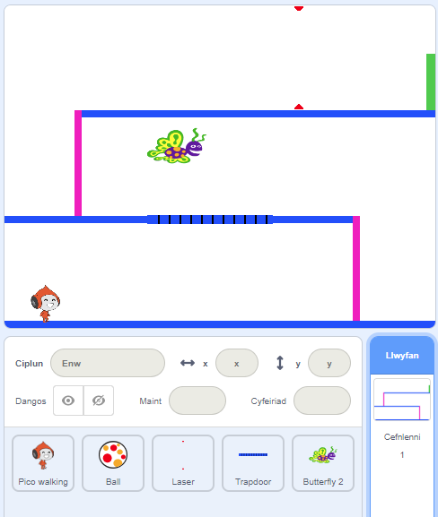

## Her: mwy o rwystrau

Os wyt ti dal i feddwl bod dy gêm yn rhy hawdd, mae modd i ti ychwanegu mwy o rwystrau. Mae modd i ti ychwanegu unrhywbeth! Dyma rai syniadau:

+ Pili-pala sy’n hedfan
+ Platfform sydd yn ymddangos a diflannu
+ Peli tenis sydd yn rhaid osgoi



Mae modd i ti hefyd greu cefndir arall i greu lefel arall. Yna ychwanega gôd, fel pan fo'r cymeriad yn cyrraedd y drws gwyrdd, mae'r gêm yn newid i'r cefndir newydd:


```blocks3
    if <touching color [#00FF00]?> then
        switch backdrop to (next backdrop v)
        go to x: (-210) y: (-120)
        wait (1) seconds
    end
```