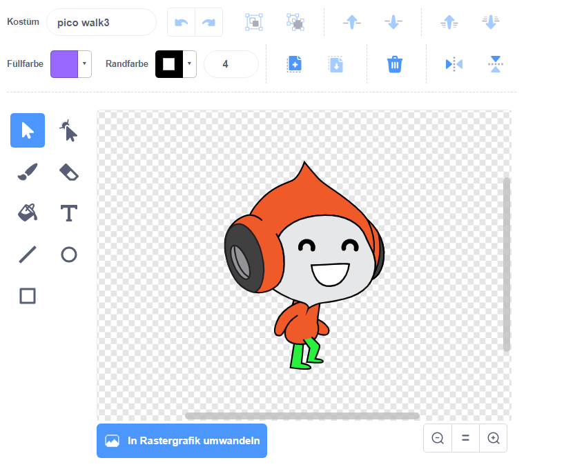

## Herausforderung: Verbesserte Schwerkraft

Es gibt einen anderen kleinen Fehler in deinem Spiel: die Schwerkraft zieht den Charakter nicht nach unten, wenn ** irgendein** Teil des Objektes eine blaue Plattform berührt. Selbst wenn der Kopf des Objektes eine Plattform berührt, fällt das Objekt nicht! Du kannst dies selbst testen: Lass deinen Charakter am meisten auf eine Leiter hinauf klettern und dann die Charaktere unter einer Plattform bewegen:


Um den Fehler zu beheben, musst du zuerst deinem Charakter neue Hosen mit einer anderen Farbe geben (auf **allen** Kostüme).



Ersetze diesen Code-Block:

```blocks3
    < touching color [#0000FF]? >
```

mit diesem Codeblock:

```blocks3
    < color [#00FF00] is touching [#0000FF]? >
```

Um sicherzustellen, dass du den Fehler behoben hast, teste das Spiel, nachdem du diese Änderungen vorgenommen hast!