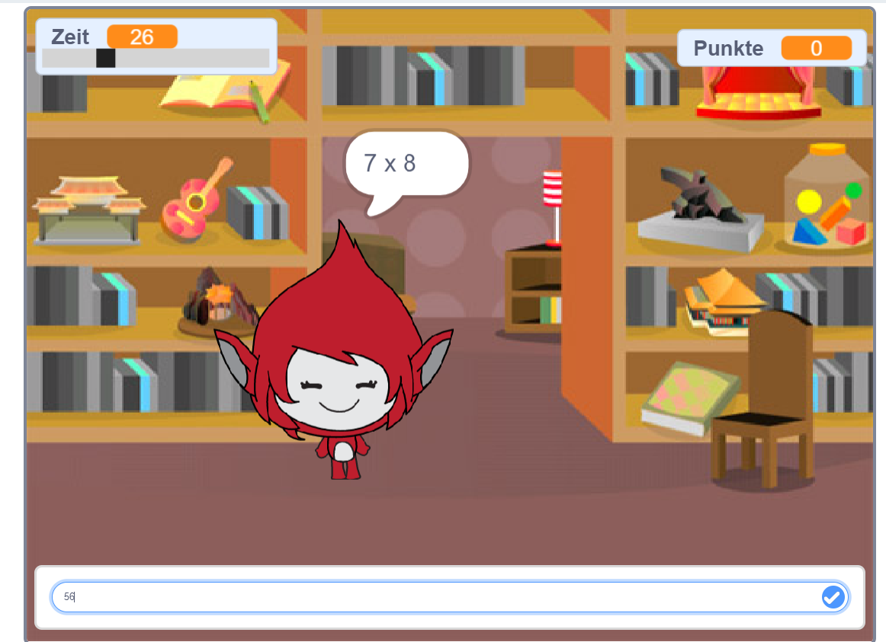

## Wie geht es weiter?

Probiere unser Gehirnspiel [Brain game](https://projects.raspberrypi.org/de-DE/projects/brain-game?utm_source=pathway&utm_medium=whatnext&utm_campaign=projects) aus, in dem du dein eigenes Mathe-Quiz erstellen kannst.

--- no-print --- Klicke auf den Knopf, um zu starten. Geben eine Antwort auf die Frage ein und drücke dann die <kbd>Enter</kbd> Taste.

  <iframe allowtransparency="true" width="485" height="402" src="https://scratch.mit.edu/projects/embed/335040340/?autostart=false" frameborder="0" scrolling="no"></iframe>
  

--- /no-print ---

--- print-only ---  --- /print-only ---

***

Dieses Projekt wurde von freiwilligen Helfern übersetzt:

Dennis Weber

Tim

Dank freiwilliger Helfer können wir Menschen auf der ganzen Welt die Möglichkeit geben, in ihrer eigenen Sprache zu lernen. Du kannst uns helfen, mehr Menschen zu erreichen, indem Du dich freiwillig zum Übersetzen meldest - weitere Informationen unter [rpf.io/translate](https://rpf.io/translate).