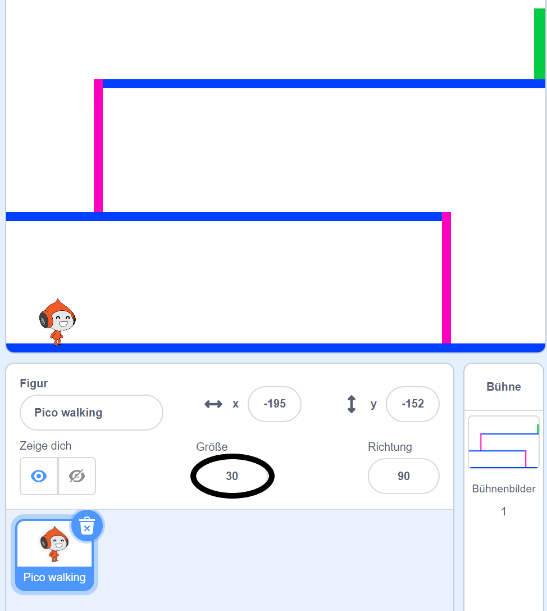
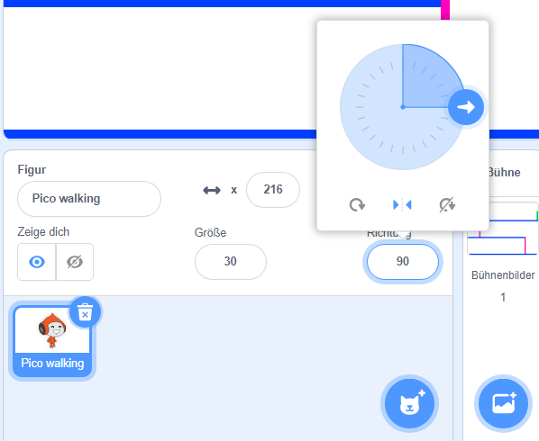

## Bewegung der Spielfigur

Erstelle als Erstes einen Charakter, der sich nach links und rechts bewegen und auf Leitern klettern kann.

\--- task \---

Öffne das Scratch-Startprojekt 'Dodgeball'.

**Online:** open the starter project at [rpf.io/dodgeball-on](https://rpf.io/dodgeball-on){:target="_blank"}.

Wenn du bereits einen Scratch-Account besitzt, kannst du dir durch Klick auf **Remix** eine Kopie anlegen.

**Offline:** download the starter project from [rpf.io/p/en/dodgeball-get](https://rpf.io/p/en/dodgeball-get) and then open it using the offline editor.

\--- /task \---

Das Projekt enthält einen Hintergrund mit Plattformen:


\--- task \---

Wähle eine neue Figur als Charakter, den der Spieler steuern wird, und füge sie zu deinem Projekt hinzu. Es ist am besten, wenn du eine Figur mit mehreren Kostümen wählst, damit du es so aussehen lassen kannst, als ob sie geht.


[[[generic-scratch3-sprite-from-library]]]

\--- /task \---

\--- task \---

Füge Code-Blöcke zu deiner Figur hinzu, damit der Spieler die Pfeiltasten verwenden kann, um den Charakter umher zu bewegen. Wenn der Spieler den Rechtspfeil drückt, sollte der Charakter nach rechts zeigen, ein paar Schritte gehen und zum nächsten Kostüm wechseln:


```blocks3
Wenn die grüne Flagge angeklickt
wiederhole fortlaufend 
  falls <Taste (Pfeil nach rechts v) gedrückt? > , dann 
    setze Richtung auf (90 v) Grad
    gehe (3) er Schritt
    wechsle zum nächsten Kostüm
  end
end
```

\--- /task \---

\--- task \---

Falls deine Figur nicht passt, passe die Größe an.



\--- /task \---

\--- task \---

Teste die Figur deines Spielers, indem du auf die Flagge klickst und dann den Pfeil nach rechts gedrückt hältst. Bewegt sich dein Charakter nach rechts? Sieht dein Charakter so aus, als würde er laufen?


\--- /task \---

\--- task \---

Füge Code-Blöcke zu der `wiederhohle fortlaufend`{:class="block3control"} Schleife der Charakter-Figur hinzu, damit sie nach links geht, wenn die linke Pfeiltaste gedrückt wird.

\--- hints \---

\--- hint \---

Damit sich dein Charakter nach links bewegen kann, musst du einen weiteren `falls`{:class="block3control"} Block in der `wiederhohle fortlaufend`{:class ="block3control"} Schleife hinzufügen. Füge in diesen neuen `falls`{:class="block3control"} Block, Code hinzu, um deine Charakter-Figur nach links `gehen`{:class="block3motion"} zu lassen.

\--- /hint \---

\--- hint \---

Kopiere den Code, den du erstellt hast, um den Charakter nach rechts laufen zu lassen. Setze dann die `gedrückte Taste`{:class="block3sensing"} auf `Pfeil nach links`{:class="block3sensing"}, und ändere die `Richtung`{:class="block3motion"} auf `-90`.

```blocks3
falls <Taste (Pfeil nach rechts v) gedrückt? > , dann 
  setze Richtung auf (90 v) Grad
  gehe (3) er Schritt
  wechsle zum nächsten Kostüm
end
```

\--- /hint \---

\--- hint \---

Dein Code sollte so aussehen:


```blocks3
Wenn die grüne Flagge angeklickt
wiederhole fortlaufend 
  falls <Taste (Pfeil nach rechts v) gedrückt?> , dann 
    setze Richtung auf (90 v) Grad
    gehe (3) er Schritt
    wechsle zum nächsten Kostüm
  end
  falls <Taste (Pfeil nach links v) gedrückt?> , dann 
    setze Richtung auf (-90 v) Grad
    gehe (3) er Schritt
    wechsle zum nächsten Kostüm
  end
end
```

\--- /hint \---

\--- /hints \---

\--- /task \---

\--- task \---

Teste den neuen Code, um sicherzustellen, dass er funktioniert. Stellt sich dein Charakter auf den Kopf, wenn du nach links gehst?


Wenn ja, kannst du dies beheben, indem du auf die **Richtung** deiner Charakter Figur klickst und dann auf den Pfeil nach links und rechts klickst.



Wenn du möchtest, kannst du das Problem auch beheben, indem du diesen Block am Anfang des Skripts deines Charakters einfügst:

```blocks3
setze Drehtyp auf [links-rechts v]
```

\--- /task \---

\--- task \---

Um eine rosafarbene Leiter zu besteigen, sollte sich deine Charakter-Figur auf dem Spielfeld ein paar Schritte nach oben bewegen, wenn der Pfeil nach oben gedrückt wird **und** der Charakter die richtige Farbe berührt.

Füge Codeblöcke zu der `wiederhohle fortlaufend`{:class="block3control"} Schleife deines Charakters hinzu, um die `y` (vertikale) Position des Charakters zu `ändern`{:class="block3motion"}, `falls`{:class="block3control"} die `Pfeiltaste nach oben`{:class="block3sensing"} gedrückt wird und der Charakter die `Pinke Farbe berührt`{:class="block3sensing"}.


```blocks3
    falls <<Taste (Pfeil nach oben v) gedrückt?> und <wird Farbe [#FF69B4] berührt?>> , dann 
  ändere y um (4)
end
```

\--- /task \---

\--- task \---

Teste deinen Code. Schaffst du es, dass der Charakter die rosafarbenen Leitern erklimmt und das Ende des Levels erreicht?


\--- /task \---