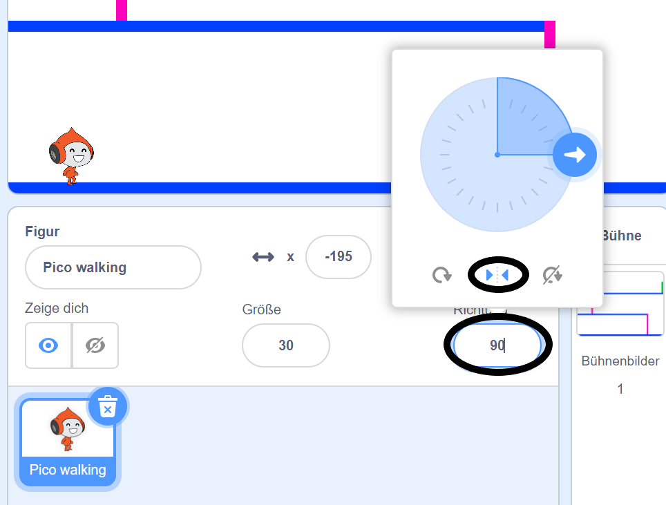

## Bewegung der Spielfigur

Erstelle als Erstes einen Charakter, der sich nach links und rechts bewegen und auf Leitern klettern kann.

--- task ---

Öffne das Scratch-Startprojekt 'Dodgeball'.

**Online:** Öffne das Basisprojekt auf [rpf.io/dodgeball-on](http://rpf.io/dodgeball-on){:target="_blank"}.

Wenn du bereits einen Scratch-Account besitzt, kannst du dir durch Klick auf **Remix** eine Kopie anlegen.

**Offline:** Lade das Basisprojekt von [rpf.io/p/de-DE/dodgeball-get](http://rpf.io/p/de-DE/dodgeball-get){:target="_blank"} herunter und öffne es dann mit dem Scratch Offline-Editor.

--- /task ---

Das Projekt enthält einen Hintergrund mit Plattformen:


--- task ---

Wähle ein neues Sprite als Charakter, den der Spieler steuern wird, und füge es zu deinem Projekt hinzu. Es ist am besten, wenn du ein Sprit mit mehreren Kostümen wählst, damit du es so aussehen lässt, als ob es geht.


[[[generic-scratch3-sprite-from-library]]]

--- /task ---

--- task ---

Füge Code-Blöcke zu deinem Sprite hinzu, damit der Spieler die Pfeiltasten verwenden kann, um den Charakter umher zu bewegen. Wenn der Spieler den Rechtspfeil drückt, sollte der Charakter nach rechts zeigen, ein paar Schritte gehen und zum nächsten Kostüm wechseln:


```blocks3
Wenn die grüne Flagge angeklickt
wiederhole fortlaufend 
  if <key (right arrow v) pressed? > then
setze Richtung auf (90 v) Grad
gehe (3) er Schritt
wechsle zum nächsten Kostüm
end
end
```

--- /task ---

--- task ---

Wenn dein Sprite nicht passt, passe die Größe an.


--- /task ---

--- task ---

Teste die Figur deines Spielers, indem du auf die Flagge klickst und dann den Pfeil nach oben gedrückt hältst. Bewegt sich dein Charakter nach rechts? Sieht dein Charakter so aus, als würde er laufen?


--- /task ---

--- task ---

Füge Code-Blöcke zu der `wiederhohle fortlaufend`{:class="block3control"} Schleife des Charakter-Sprites hinzu, damit es nach links geht, wenn die linke Pfeiltaste gedrückt wird.

--- hints ---

--- hint ---

Damit sich dein Charakter nach links bewegen kann, musst du einen weiteren `falls`{:class="block3control"} Block in der `wiederhohle fortlaufend`{:class ="block3control"} Schleife hinzufügen. In diesen neuen `falls`{:class="block3control"} Block, füge einen Code hinzu, um deinen Sprite Charakter nach links `gehen`{:class="block3motion"} zu lassen.

--- /hint ---

--- hint ---

Kopiere den Code, den du erstellt hast, um den Charakter nach rechts laufen zu lassen. Setze dann die `gedrückte Taste`{:class="block3sensing"} auf `Pfeil nach links`{:class="block3sensing"}, und ändere die `Richtung`{:class="block3motion"} auf `-90`.

```blocks3
falls <Taste (right arrow v) gedrückt? > , dann 
  setze Richtung auf (90 v) Grad
  gehe (3) er Schritt
  wechsle zum nächsten Kostüm
end
```

--- /hint ---

--- hint ---

Dein Code sollte so aussehen:


```blocks3
Wenn die grüne Flagge angeklickt
wiederhole fortlaufend 
falls <key (right arrow v) pressed?> , dann 
setze Richtung auf (90 v) Grad
gehe (3) er Schritt
wechsle zum nächsten Kostüm
end
falls <key (left arrow v) pressed?> , dann 
setze Richtung auf (-90 v) Grad
gehe (3) er Schritt
wechsle zum nächsten Kostüm
end
end
```

--- /hint ---

--- /hints ---

--- /task ---

--- task ---

Teste den neuen Code, um sicherzustellen, dass er funktioniert. Stellt sich dein Charakter auf den Kopf, wenn du nach links gehst?


Wenn ja, kannst du dies beheben, indem du auf die **Richtung** von deinen Charakter Sprite klickst und dann auf den Pfeil nach links und rechts klickst.



Wenn du möchtest, kannst du das Problem auch beheben, indem du diesen Block am Anfang des Skripts deines Charakters einfügst:

```blocks3
setze Drehtyp auf [left-right v]
```

--- /task ---

--- task ---

Um eine rosafarbene Leiter zu besteigen, sollte sich dein Charakter-Sprite auf dem Spielfeld ein paar Schritte nach oben bewegen, wenn der Aufwärtspfeil gedrückt wird **und** der Charakter die richtige Farbe berührt.

Füge zu der `wiederhohle fortlaufend`{:class="block3control"} Schleife deines Charakters, um die `y` (vertikale) Position des Charakters zu verändern `ändere` {:class="block3motion"}, `falls` {:class="block3control"} die `Pfeiltaste nach oben`{:class="block3sensing"} gedrückt wird und der Charakter die `Pinke Farbe berührt`{:class="block3sensing"}, hinzu.


```blocks3
    falls <<key (up arrow v) pressed?> und <touching color [#FF69B4]?>> , dann 
  ändere y um (4)
end
```

--- /task ---

--- task ---

Teste deinen Code. Schaffst du es, dass der Charakter die rosafarbenen Leitern erklimmt und das Ende des Levels erreicht?


--- /task ---