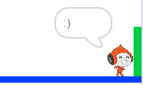

## Herausforderung: Das Level abschließen

Kannst du zu deinem Charakter-Sprite weitere Codeblöcke hinzufügen, damit das Sprite etwas sagt, `falls`{:class="block3control"} es zur grünen Tür kommt?

