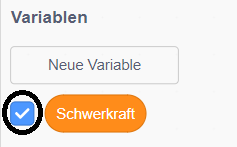

## Schwerkraft und springen

Jetzt bringst du deinen Charakter dazu, sich realistischer zu bewegen: Du wirst deinem Spiel Schwerkraft verleihen und dem Charakter die Möglichkeit zum Springen geben.

\--- task \---

Im Spiel bewegt sich dein Charakter, als ob er von einer Plattform geht. Siehst du, dass er in leeren Raum gehen kann?


\--- /task \---

\--- task \---

Um dies zu beheben, füge dem Spiel Schwerkraft hinzu. Erstelle eine neue Variable namens `Schwerkraft`{:class="block3variables"}.

[[[generic-scratch3-add-variable]]]

Du kannst diese Variable aus deinem Spielfeld ausblenden, wenn du möchtest.



\--- /task \---

\--- task \---

Füge diese neuen Codeblöcke hinzu, um die `Schwerkraft` auf eine negative Zahl festzulegen und verwende den Wert von `Schwerkraft`, um die y-Koordinate deines Charakters fortlaufend zu ändern:


```blocks3
    Wenn die grüne Flagge angeklickt
setze [Schwerkraft v] auf [-4]
wiederhole fortlaufend 
ändere y um (Schwerkraft)
end
```

\--- /task \---

\--- task \---

Klicke auf die Flagge und ziehe deinen Charakter an den oberen Rand des Spielfeldes. Was ist passiert? Funktioniert die Schwerkraft wie erwartet?


\--- /task \---

\--- task \---

Die Schwerkraft sollte das Sprite des Charakters nicht durch eine Plattform oder eine Leiter bewegen! Füge einen `falls`{:class="block3control"} Baustein zu deinen Code hinzu, um die Schwerkraft nur dann funktionieren zu lassen, wenn das Zeichen in der Mitte ist. Der Schwerkraftcode sollte dann so aussehen:


```blocks3
    Wenn die grüne Flagge angeklickt
setze [Schwerkraft v] auf [-4]
wiederhole fortlaufend 
  falls < nicht < <touching color [#0000FF]?> oder <touching color [#FF69B4]?> > > , dann 
    ändere y um (Schwerkraft)
  end
end
```

\--- /task \---

\--- task \---

Teste das Spiel erneut, um zu sehen, ob die Schwerkraft jetzt korrekt funktioniert. Fällt dein Charakter-Sprit nicht mehr, wenn er eine Plattform oder eine Leiter berührt? Kannst du den Charakter dazu bringen, von den Rändern der Plattformen zu laufen und auf das Level darunter zu fallen?


\--- /task \---

\--- task \---

Füge nun einen Code hinzu, um deinen Charakter springen zu lassen, wenn der Spieler die <kbd>Leertaste</kbd> drückt. Eine sehr einfache Möglichkeit, dies zu tun, besteht darin, deinen Charakter ein paar Mal nach oben zu bewegen:


```blocks3
    Wenn Taste [Leertaste v] gedrückt wird
wiederhole (10) mal 
  ändere y um (4)
end
```

Da die Schwerkraft Ihren Charakter ständig 4 Pixel nach unten drückt, musst du eine Zahl größer als `4` wählen in deinen `ändere y um (4)`{:class="block3motion"} Block. Ändere die Zahl, bis du mit der Höhe, in der der Charakter springt, zufrieden bist.

\--- /task \---

\--- task \---

Teste deinen Code. Beachte, dass die Sprungbewegung nicht sehr flüssig ist. Damit das Springen flüssiger aussieht, musst du deinen Sprite Charakter immer in kleiner und kleiner werdende Mengen bewegen, bis es nicht mehr höher steigt.

\--- /task \---

\--- task \---

Hierzu erstelle eine neue Variable namens `Sprunghöhe`{:class="block3variables"}. Auch diese Variable kannst du ausblenden, wenn du möchtest.

\--- /task \---

\--- task \---

Lösche den Sprungcode, den du deinem Charakter-Sprite hinzugefügt hast, und füge stattdessen diesen Code hinzu:


```blocks3
    Wenn Taste [Leertaste v] gedrückt wird
setze [Sprunghöhe v] auf [8]
wiederhole bis <(Sprunghöhe) = [0]> 
  ändere y um (Sprunghöhe)
  ändere [Sprunghöhe v] um (-0.5)
end
```

Dieser Code verschiebt deinen Charakter um 8 Pixel, dann um 7,5 Pixel, dann um 7 Pixel usw., bis er nicht mehr höher steigt. Das macht das Springen viel geschmeidiger.

\--- /task \---

\--- task \---

Ändere den Wert der `Sprunghöhe`{:class="block3variables"} Variable, welche vor dem Starten der Wiederholung `wiederhohle`{:class="block3control"} gesetzt wird. Teste nun dein Spiel.

Wiederhole diese beiden Schritte, bis du mit der Höhe des springenden Charakters zufrieden bist.

\--- /task \---