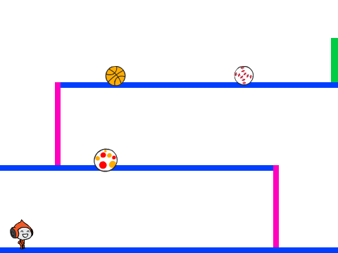

## Herausforderung: zufällige Bälle

Die Kugeln, den dein Charakter ausweichen muss, sehen alle gleich aus und erscheinen in regelmäßigen Abständen von drei Sekunden. Du kannst Codes zu deinem Spiel hinzufügen, damit die Kugeln:

+ Nicht alle gleich aus sehen?
+ Nach einer Zufalls ` random` {: class = "block3operators"} Zeitdauer erscheinen?
+ Eine zufällige Größe haben?

