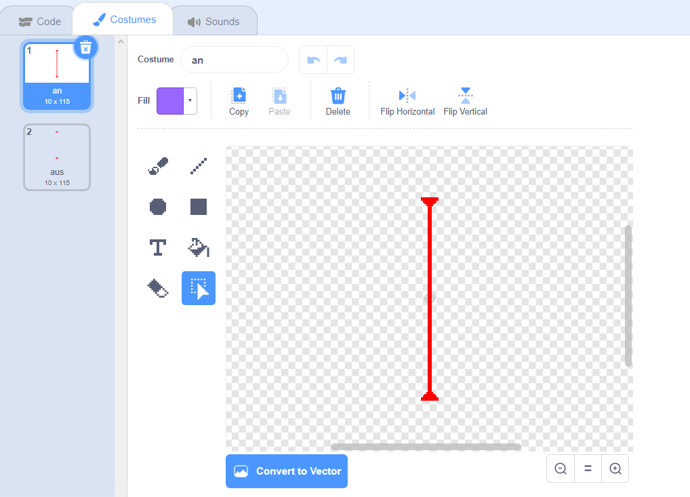
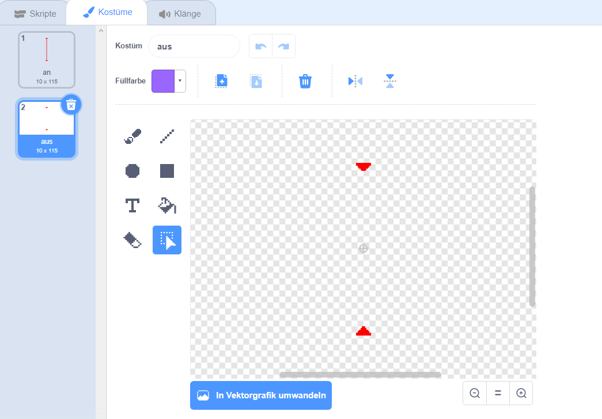

## Laser!

Um dein Spiel ein wenig schwieriger beenden zu lassen, wirst du Laser hinzufügen!

\--- task \---

Füge eine neue Figur zu deinem Spiel hinzu und nenne sie `laser`. Sie sollte zwei Kostüme haben: eins das 'an' heißt und eins das 'aus' heißt.





\--- /task \---

\--- task \---

Platziere deine neue Laser-Figur zwischen zwei Plattformen.


\--- /task \---

\--- task \---

Füge diesen Code zu deiner Laser-Figur hinzu, um sie zwischen den beiden Kostümen wechseln zu lassen.


```blocks3
    Wenn die grüne Flagge angeklickt
wiederhole fortlaufend 
  wechsle zu Kostüm (an v)
  warte (2) Sekunden
  wechsle zu Kostüm (aus v)
  warte (2) Sekunden
end
```

Wenn du möchtest, kannst du den oben gezeigten Code so ändern, dass die Figur eine `zufällige`{:class="block3operators"} Zeitspanne zwischen den Kostümwechseln `wartet`{:class="block3control"}.

\--- /task \---

\--- task \---

Anschließend fügst du Code zu deinem Lasersprite hinzu, sodass die Laser-Figur eine Treffer-Nachricht sendet, wenn die die Charakter Figur berührt.

\--- hints \---

\--- hint \---

Dieser Code sollte sehr ähnlich sein wie der Code, den du zu deiner Ball-Figur hinzugefügt hast.

\--- /hint \---

\--- hint \---

Kopiere den Code, den du der Ball-Figur hinzufügst hast, damit die Figur `'Terffer' sendet`{:class="block3control"}, falls `es deinen Charakter berührt`{:class="block3sensing"}.

\--- /hint \---

\--- hint \---

Dies ist der Code, den du dafür hinzufügen sollst:


```blocks3
Wenn die grüne Flagge angeklickt
wiederhole fortlaufend 
  falls <wird (Pico walking v) berührt?> , dann 
    sende (Treffer v) an alle
  end
end
```

\--- /hint \---

\--- /hints \---

Du musst keinen zusätzlichen Code zu deiner Charakter-Figur hinzufügen, da die Charakter-Figur bereits weiß, was sie zu tun hat, wenn sie die `Nachricht 'Treffer'`{:class="block3control"} erhält!

\--- /task \---

\--- task \---

Teste dein Spiel, um festzustellen, ob du den Charakter am Laser vorbeibewegen kannst. Falls es zu leicht oder zu schwer ist dem Laser auszuweichen, ändere die `Wartezeit`{:class="block3control"} im Code für die Laser-Figur.

\--- /task \---