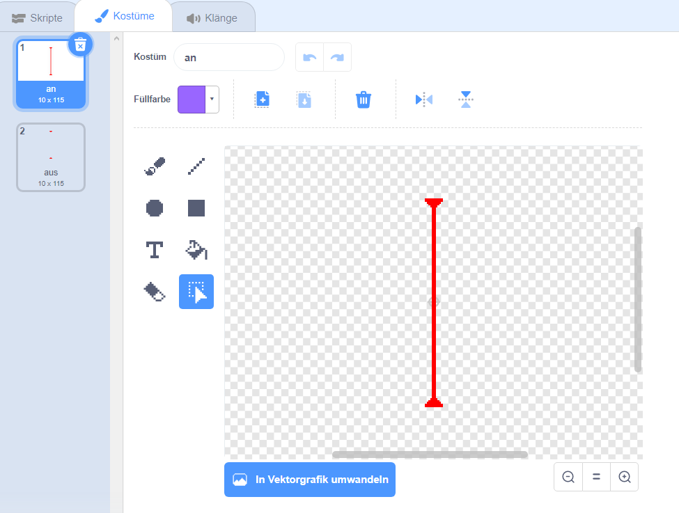

## Laser!

Um dein Spiel ein wenig schwieriger beenden zu lassen, wirst du Laser hinzufügen!

\--- task \---

Füge ein neues Sprite zu deinem Spiel hinzu und nenne es `laser`. Es sollte zwei Kostüme haben: eins mit 'an' und eins mit 'aus'.




\--- /task \---

\--- task \---

Platziere dein neues Lasersprite zwischen zwei Plattformen.


\--- /task \---

\--- task \---

Füge diesen Code zu deinem Lasersprite hinzu, um ihn zwischen den beiden Kostümen wechseln zu lassen.


```blocks3
    Wenn die grüne Flagge angeklickt
wiederhole fortlaufend 
  wechsle zu Kostüm (an v)
  warte (2) Sekunden
  wechsle zu Kostüm (aus v)
  warte (2) Sekunden
end
```

Wenn du möchtest, kannst du den oben gezeigten Code so ändern, dass das Sprite eine `zufällige`{:class="block3operators"} Zeitspanne zwischen den Kostümwechseln `wartet`{:class="block3control"}.

\--- /task \---

\--- task \---

Anschließend fügst du Code zu deinem Lasersprite hinzu, sodass der Lasersprite eine Treffer-Nachricht sendet, wenn es den Charakter Sprite berührt.

\--- hints \---

\--- hint \---

Dieser Code sollte sehr ähnlich sein wie der Code, den du zu deinem Ball-Sprite hinzugefügt hast.

\--- /hint \---

\--- hint \---

Kopier den Code, den du dem Ball-Sprite hinzufügst hast, damit das Sprite `sende 'Terffer'`{:class="block3control"} ausführt, wenn `es deinen Charakter berührt`{:class="block3sensing"}.

\--- /hint \---

\--- hint \---

Dies ist der Code, den du dafür hinzufügen sollst:


```blocks3
Wenn die grüne Flagge angeklickt
wiederhole fortlaufend 
  falls <touching (Pico walking v) ?> , dann 
    sende (Treffer v) an alle
  end
end
```

\--- /hint \---

\---/hints\---

Du musst keinen zusätzlichen Code zu deinem Charakter-Sprite hinzufügen, da das Charakter-Sprite bereits weiß, was es zu tun hat, wenn es `sende 'Treffer'`{:class="block3control"} erhält!

\--- /task \---

\--- task \---

Teste dein Spiel, um festzustellen, ob du den Charakter am Laser vorbeibewegen kannst. Wenn der Laser zu leicht oder zu schwer zu meiden ist, ändere die `Wartezeit `{:class="block3control"} im Code für das Laser-Sprite.

\--- /task \---