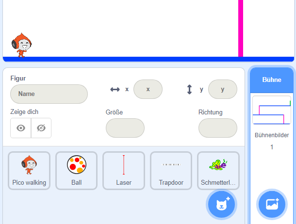

## Herausforderung: Mehr Hindernisse

Wenn du denkst, dass dein Spiel noch zu einfach ist, kannst du mehr Hindernisse hinzufügen. Die Hindernisse können alles sein, was du willst! Hier sind ein paar Vorschläge:

+ Ein gefährlicher Schmetterling
+ Plattformen, die erscheinen und verschwinden
+ Fallende Tennisbälle, denen ausgewichen werden muss



Du kannst sogar einen anderen Hintergrund entwerfen, um das nächste Level zu erstellen. Füge dann Code hinzu, sodass das Spiel in den neuen Hintergrund wechselt, wenn dein Charakter die grüne Tür erreicht:


```blocks3
    falls <wird Farbe [#00FF00] berührt?> , dann 
  wechsle zu Bühnenbild (nächstes Bühnenbild v)
  gehe zu x: (-210) y: (-120)
  warte (1) Sekunden
end
```