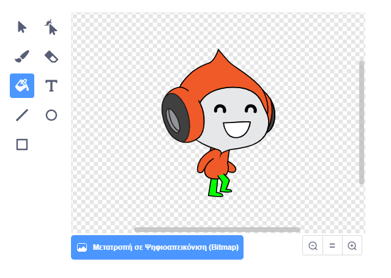

## Δοκιμασία: βελτιωμένη βαρύτητα

Υπάρχει ένα ακόμη μικρό σφάλμα στο παιχνίδι σου: η βαρύτητα δεν τραβάει την εικόνα του χαρακτήρα προς τα κάτω αν **οποιοδήποτε** τμήμα της αγγίζει μια μπλε πλατφόρμα. Έτσι, ακόμη και αν το κεφάλι του χαρακτήρα αγγίζει μια πλατφόρμα, ο χαρακτήρας δεν πέφτει! Μπορείς να δοκιμάσεις και μόνος σου: κάνε το χαρακτήρα σου να ανέβει μέχρι σε ένα σημείο μιας σκάλας και στη συνέχεια μετακίνησε τον χαρακτήρα πλάγια, κάτω από μια πλατφόρμα:


Για να διορθώσεις το σφάλμα, πρέπει πρώτα να δώσεις στο χαρακτήρα σου ένα νέο παντελόνι με διαφορετικό χρώμα (σε **όλα**τα κοστούμια).



Στη συνέχεια αντικατέστησε αυτό το τουβλάκι κώδικα:

```blocks3
    < touching color [#0000FF]? >
```

με αυτό το τουβλάκι κώδικα:

```blocks3
    < color [#00FF00] is touching [#0000FF]? >
```

Για να βεβαιωθείς ότι έχεις διορθώσει το σφάλμα, δοκίμασε το παιχνίδι αφού έχεις κάνει αυτές τις αλλαγές!