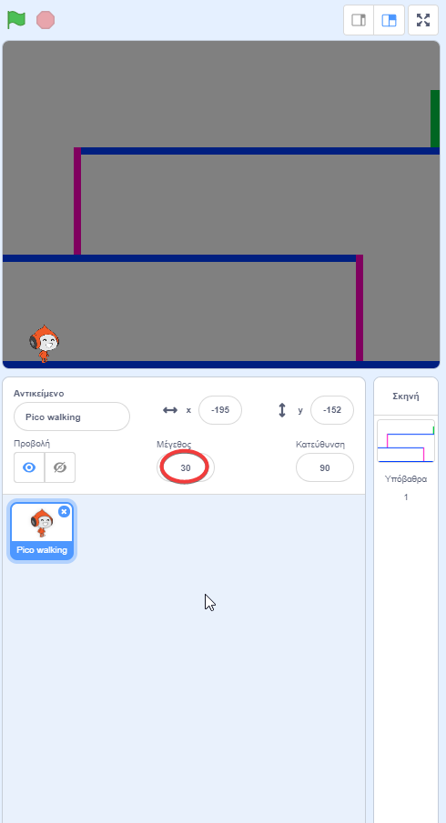
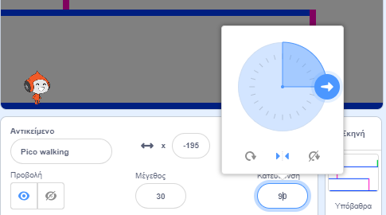

## Κινηση χαρακτήρων

Ξεκινήστε δημιουργώντας έναν χαρακτήρα που μπορεί να κινηθεί αριστερά και δεξιά και μπορεί να ανέβει πάνω σε σκάλες.

\--- task \---

Άνοιξε το αρχικό έργο Scratch "Dodgeball".

**Online:** άνοιξε το αρχικό έργο στο [rpf.io/dodgeball-on](http://rpf.io/dodgeball-on){:target="_blank"}.

Αν έχεις λογαριασμό Scratch μπορείς να κάνεις ένα αντίγραφο, κάνοντας κλικ στο κουμπί **Ανάμειξη**.

**Offline:** κατέβασε το αρχικό έργο από το [rpf.io/p/en/dodgeball-get](http://rpf.io/p/en/dodgeball-get), και κατόπιν άνοιξέ το με τον offline editor.

\--- /task \---

Το έργο περιέχει ένα σκηνικό με πλατφόρμες:


\--- task \---

Επιλέξτε ένα νέο αντικείμενο που θα ελέγχει ο παίκτης και προσθέστε το στο έργο σας. Είναι καλύτερο να επιλέγετε ένα αντικείμενο με πολλές ενδυμασίες, ώστε να μπορείτε να το φανείτε σαν να περπατάει.


[[[generic-scratch3-sprite-from-library]]]

\--- /task \---

\--- task \---

Προσθέστε μπλοκ στο αντικείμενο σας, ώστε ο παίκτης να μπορεί να χρησιμοποιήσει τα πλήκτρα βέλους για να μετακινήσετε το αντικείμενο. Όταν ο παίκτης πιέσει το δεξιό βέλος, ο χαρακτήρας πρέπει να δείχνει δεξιά, να μετακινεί μερικά βήματα και να αλλάζει στην επόμενη ενδυμασία:


```blocks3
όταν στην πράσινη σημαία γίνει κλικ
για πάντα 
  εάν <πατήθηκε το πλήκτρο (Δεξι βέλος v) πατηθηκε; > τότε 
    στρίψε προς την κατεύθυνση των (90) μοιρών 
    κινήσου (3) βήματα
        επόμενη ενδυμασία
  end 
end
```

\--- /task \---

\--- task \---

Εάν tο αντικείμενο σας δεν ταιριάζει, προσαρμόστε το μέγεθος του.



\--- /task \---

\--- task \---

Δοκιμάστε το χαρακτήρα σας κάνοντας κλικ στη σημαία και στη συνέχεια κρατώντας πατημένο το δεξί πλήκτρο βέλους. Ο χαρακτήρας σας κινείται προς τα δεξιά; Ο χαρακτήρας σας μοιάζει να περπατάει;


\--- /task \---

\--- task \---

Προσθέστε τα μπλοκ στο αντικείμενο ` για πάντα ` {: class = "block3control"} για να περπατήσει αριστερά αν πατηθεί το αριστερό πλήκτρο βέλους.

\--- hints \---

\--- hint \---

Για να μετακινηθεί ο χαρακτήρας σας προς τα αριστερά, θα πρέπει να προσθέσετε άλλο ` αν ` {: class = "block3control"} μπλοκ μέσα στο ` για πάντα ` {: class = "block3control"}. Σε αυτό το νέο ` αν ` {block: block3control} μπλοκ, προσθέστε τον κώδικα για να μετακινήσετε τον αντικείμενο ` ` {: class = "block3motion"} προς τα αριστερά.

\--- /hint \---

\--- hint \---

Αντιγράψτε τον κώδικα που δημιουργήσατε για να κάνετε τον χαρακτήρα να περπατησει προς τα δεξιά. Then set the `key pressed`{:class="block3sensing"} to the `left arrow`{:class="block3sensing"}, and change the `direction`{:class="block3motion"} to `-90`.

```blocks3
if <key (right arrow v) pressed? > τότε 
    στρίψε προς την κατεύθυνση των (90) μοιρών 
    κινήσου (3) βήματα
    επόμενη ενδυμασία
  end
```

\--- /hint \---

\--- hint \---

Your code should look like this now:


```blocks3
όταν η πράσινη σημαία γίνει κλικ
για πάντα 
  εάν <key (right arrow v) pressed?> τότε 
    στρίψε προς την κατεύθυνση (90 v)
     κίνηση (3) βήματα
    επόμενη ενδυμασία
  end
  εάν <key (left arrow v) pressed?> έπειτα 
    σε κατεύθυνση (-90 v)
    κίνηση (3) βήματα
    επόμενη ενδυμασία
  end
end
```

\--- /hint \---

\--- /hints \---

\--- /task \---

\--- task \---

Test your new code to make sure that it works. Does your character turn upside-down when walking to the left?


If so, you can fix this by clicking on the **direction** of your character sprite, and then clicking on the left-right arrow.



Or if you prefer, you can also fix the problem by adding this block to the start of your character's script:

```blocks3
set rotation style [left-right v]
```

\--- /task \---

\--- task \---

To climb a pink ladder, your character sprite should move a few steps upwards on the Stage whenever the up arrow is pressed **and** the character is touching the correct colour.

Add inside your character's `forever`{:class="block3control"} loop to `change`{:class="block3motion"} the character's `y` (vertical) position `if`{:class="block3control"} the `up arrow is pressed`{:class="block3sensing"} and the character is `touching the colour pink`{:class="block3sensing"}.


```blocks3
    if < <key (up arrow v) pressed?> and <touching color [#FF69B4]?> > then
        change y by (4)
    end
```

\--- /task \---

\--- task \---

Test your code. Can you make the character climb the pink ladders and get to the end of the level?


\--- /task \---