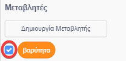

## Gravity and jumping

Τώρα θα κάνετε τον χαρακτήρα σας να κινείται πιο ρεαλιστικά: πρόκειται να προσθέσετε τη βαρύτητα στο παιχνίδι σας και να δώσετε στον χαρακτήρα τη δυνατότητα να πηδήσει.

\--- task \---

Στο παιχνίδι, μετακινήστε το χαρακτήρα σας έτσι ώστε να περπατά από μια πλατφόρμα. Βλέπετε ότι μπορεί να περπατήσει σε κενό χώρο;


\--- /task \---

\--- task --

Για να διορθώσετε αυτό, προσθέστε βαρύτητα στο παιχνίδι σας. To do this, create a new variable called `gravity`{:class="block3variables"}.

[[[generic-scratch3-add-variable]]]

Μπορείτε να αποκρύψετε αυτήν τη μεταβλητή από το Σκήνη σας, αν θέλετε.



\--- /task \---

\--- task \---

Προσθέστε αυτά τα νέα μπλοκ κωδικών που θέτουν ` βαρύτητα ` σε αρνητικό αριθμό και χρησιμοποιήστε την τιμή της ` βαρύτητας` για να αλλάξετε επανειλημμένα τη συντεταγμένη y του χαρακτήρα σας:


```blocks3
    when flag clicked
    set [gravity v] to [-4]
    forever
        change y by (gravity)
    end
```

\--- /task \---

\--- task \---

Click the flag, and then drag your character to the top of the Stage. What happens? Does the gravity work as you expect?


\--- /task \---

\--- task \---

Gravity shouldn't move the character sprite through a platform or a ladder! Add an `if`{:class="block3control"} block to your code to only let the gravity work when the character is in mid-air. The gravity code should then look like this:


```blocks3
    when flag clicked
    set [gravity v] to [-4]
    forever
        if < not < <touching color [#0000FF]?> or <touching color [#FF69B4]?> > > then
            change y by (gravity)
        end
    end
```

\--- /task \---

\--- task \---

Δοκιμάστε ξανά το παιχνίδι για να δείτε αν η βαρύτητα λειτουργεί σωστά τώρα. Μήπως ο στίχος χαρακτήρων σας σταματά να πέφτει όταν αγγίζει μια πλατφόρμα ή μια σκάλα; Μπορείτε να κάνετε τον χαρακτήρα να περπατήσει από την άκρη των πλατφορμών και να πέσει στο επίπεδο κάτω;


\--- /task \---

\--- task \---

Now add code to make your character jump whenever the player presses the <kbd>space</kbd> key. Ένας πολύ εύκολος τρόπος να κάνετε αυτό είναι να μετακινήσετε τον χαρακτήρα σας μερικές φορές:


```blocks3
    όταν πατηθεί το πλήκτρο [space v]
    επαναλάβετε (10)
        αλλάξετε y κάτα (4)
    τέλος
```

Επειδή η βαρύτητα πιέζει συνεχώς τον χαρακτήρα σας κατά 4 pixels, πρέπει να επιλέξετε έναν αριθμό μεγαλύτερο από το ` 4 ` στην αλλαγή ` y από (4) ` {block: block3motion}}. Επαναλάβετε αυτά τα δύο βήματα μέχρι να είστε ικανοποιημένοι με το πόσο ψηλά ο χαρακτήρας μεταπηδά.

\--- /task \---

\--- task \---

Δοκίμασε τον κώδικά σου. Παρατηρήστε ότι το άλμα δεν είναι πολύ ομαλό. Για να κάνετε το άλμα να φαίνεται πιο ομαλό, θα πρέπει να μετακινήσετε τον χαρακτήρα σας από μικρότερες και μικρότερες ποσότητες, έως ότου δεν αυξάνεται.

\--- /task \---

\--- task \---

Για να γίνει αυτό, δημιουργήστε μια νέα μεταβλητή που ονομάζεται ` ύψος άλματος ` {: class = "block3variables"}. Και πάλι, μπορείτε να αποκρύψετε αυτήν τη μεταβλητή αν προτιμάτε.

\--- /task \---

\--- task \---

Διαγράψτε τον κώδικα άλματος που προσθέσατε στον χαρακτήρα σας και προσθέστε αυτόν τον κωδικό:


```blocks3
    when [space v] key pressed
    set [jump height v] to [8]
    repeat until < (jump height) = [0] >
        change y by (jump height)
        change [jump height v] by (-0.5)
    end
```

Αυτός ο κώδικας μετακινεί τον χαρακτήρα σας κατά 8 pixel, έπειτα 7,5 pixel, έπειτα 7 pixel και ούτω καθεξής, μέχρις ότου δεν αυξηθεί. Αυτό κάνει το άλμα να φαίνεται πολύ πιο ομαλό.

\--- /task \---

\--- task \---

Αλλάξτε την τιμή του `ύψους άλματος ` {: class = "block3variables"} που έχει οριστεί πριν από την ` επανάληψη` {: class = "block3control"} ξεκινά. Στη συνέχεια, δοκιμάστε το παιχνίδι σας.

Επαναλάβετε αυτά τα δύο βήματα μέχρι να είστε ικανοποιημένοι με το πόσο ψηλά ο χαρακτήρας μεταπηδά.

\--- /task \---