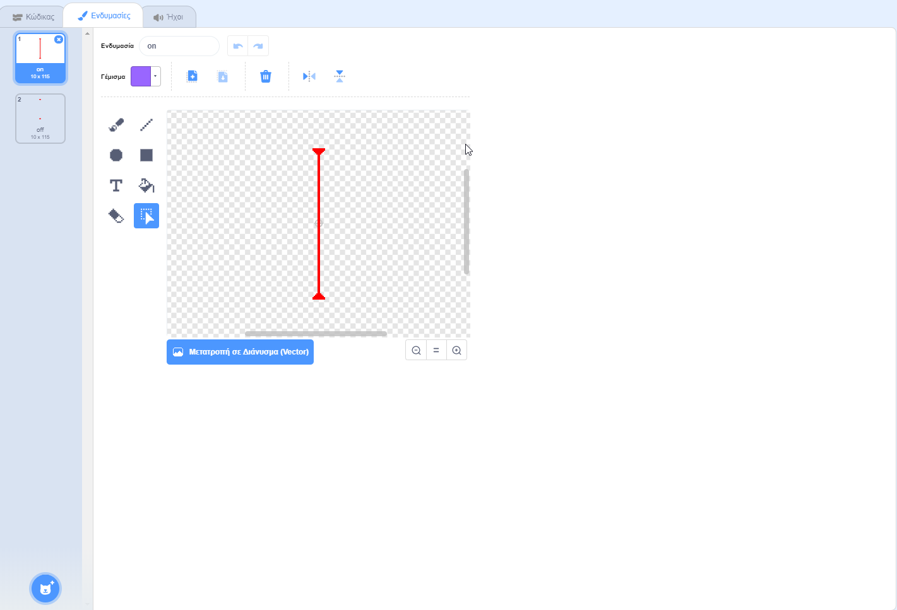
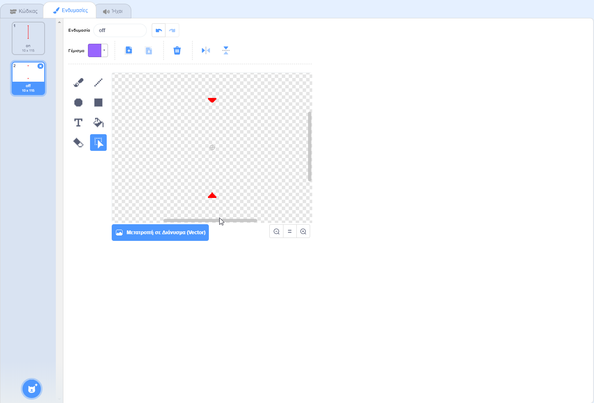

## Λέιζερ!

Για να κάνεις το παιχνίδι σου λίγο πιο δύσκολο για να ολοκληρωθεί, θα προσθέσεις λέιζερ!

\--- task \---

Πρόσθεσε μια νέα κινούμενη εικόνα στο παιχνίδι σου και ονόμασέ την `λέιζερ`. Θα πρέπει να έχει δύο κοστούμια: ένα που ονομάζεται 'on', και ένα που θα ονομάζεται 'off'.





\--- /task \---

\--- task \---

Τοποθέτησε τη νέα σου εικόνα λέιζερ ανάμεσα σε δύο πλατφόρμες.


\--- /task \---

\--- task \---

Πρόσθεσε κώδικα στην εικόνα του λέιζερ, για να το κάνεις να αλλάζει μεταξύ των δύο κοστουμιών του.


```blocks3
    when flag clicked
    forever
        switch costume to (on v)
        wait (2) seconds
        switch costume to (off v)
        wait (2) seconds
    end
```

Αν προτιμάς, μπορείς να αλλάξεις τον κώδικα που εμφανίζεται παραπάνω, έτσι ώστε η εικόνα να `περιμένει` {: class = "block3control"} για ένα `τυχαίο` {: class = "block3operators"} χρονικό διάστημα μεταξύ των αλλαγών κοστουμιών.

\--- /task \---

\--- task \---

Τέλος, πρόσθεσε κώδικα στο λέιζερ σου, έτσι ώστε η εικόνα του να μεταδίδει ένα μήνυμα 'χτυπήματος' όταν αγγίζει την εικόνα του χαρακτήρα.

\--- hints \---

\--- hint \---

Αυτός ο κώδικας θα πρέπει να είναι παρόμοιος με τον κώδικα που πρόσθεσες στην εικόνα της μπάλας.

\--- /hint \---

\--- hint \---

Αντέγραψε τον κώδικα που πρόσθεσες στην εικόνα της μπάλας, για να την κάνεις να `μεταδίδει 'χτύπημα'` {: class = "block3control"} όταν ` αγγίζει τον χαρακτήρα σου` {: class = "block3sensing"}.

\--- /hint \---

\--- hint \---

Αυτός είναι ο κώδικας που πρέπει να προσθέσεις:


```blocks3
when green flag clicked
forever 
  if <touching (Pico walking v) ?> then 
    broadcast (hit v)
  end
end
```

\--- /hint \---

\--- /hints \---

Δεν χρειάζεται να προσθέσεις επιπλέον κώδικα στην εικόνα του χαρακτήρα σου, επειδή ο χαρακτήρας γνωρίζει ήδη τι πρέπει να κάνει όταν λάβει το `μήνυμα 'χτυπήματος'` {: class = "block3control"}!

\--- /task \---

\--- task \---

Δοκίμασε το παιχνίδι σου για να δεις εάν μπορείς να μετακινήσεις το χαρακτήρα σου πέρα από το λέιζερ. Εάν είναι πολύ εύκολο ή πολύ δύσκολο να αποφύγεις το λέιζερ, άλλαξε το χρόνο `αναμονής` {: class = "block3control"} στον κώδικα για την εικόνα του λέιζερ.

\--- /task \---