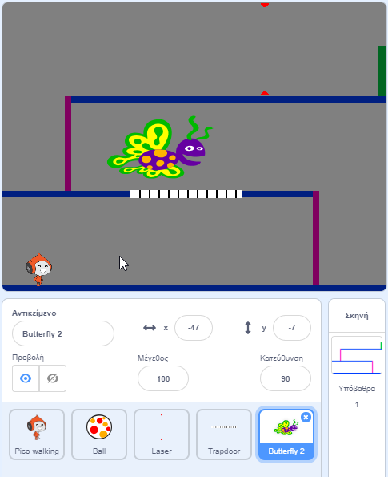

## Δοκιμασία: περισσότερα εμπόδια

Αν πιστεύεις ότι το παιχνίδι σου είναι ακόμα πολύ εύκολο, μπορείς να προσθέσεις περισσότερα εμπόδια σε αυτό. Τα εμπόδια μπορεί να είναι ο,τιδήποτε σου αρέσει! Ακολουθούν μερικές ιδέες:

+ Μια επικίνδυνη πεταλούδα
+ Πλατφόρμες που εμφανίζονται και εξαφανίζονται
+ Μπάλες του τένις που πέφτουν και πρέπει να τις αποφύγεις



Θα μπορούσες ακόμη να σχεδιάσεις ένα άλλο σκηνικό, για να δημιουργήσεις το επόμενο επίπεδο. Στη συνέχεια, πρόσθεσε τον κώδικα έτσι ώστε όταν ο χαρακτήρας σου φτάνει στην πράσινη πόρτα, το παιχνίδι να μεταβαίνει στο νέο φόντο:


```blocks3
    εάν <αγγίζει χρώμα [#00FF00] ;> τότε 
        άλλαξε υπόβαθρο σε (next backdrop v)
        πήγαινε σε θέση x: (-210) y: (-120)
        περίμενε (1) δευτερόλεπτα
    end
```