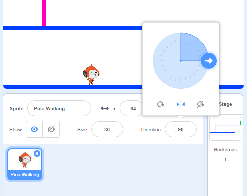

## Character movement

Let's start by creating a character that can move left and right, as well as climb up ladders.

--- task ---

Open the 'Dodgeball' starter project.

**Online:** Open Scratch starter project at [rpf.io/dodgeball-on](http://rpf.io/dodgeball-on). 

**Offline:** Download the starter project from [rpf.io/dodgeball-off](http://rpf.io/dodgeball-off) and then open it using the offline editor.

--- /task ---

The project contains a background with platforms:


--- task ---

Add a new sprite, which will be your character. It's better if you choose a sprite with multiple costumes, so that you can make it look as though it's walking.


[[[generic-scratch-sprite-from-library]]]

--- /task ---

--- task ---

Let's use the arrow keys to move your character around. When the player presses the right arrow, you want your character to point right, move a few steps and change to the next costume:


```blocks
when flag clicked
forever
	if <key [right arrow v] pressed? > then
		point in direction (90 v)
		move (3) steps
		next costume
	end
end
```

--- /task ---

--- task ---

Test out your character by clicking the flag and then holding down the right arrow key. Does your character move to the right? Does your character look like they are walking?


--- /task ---

--- task ---

Add the code to the  `forever`{:class="blockcontrol"} loop to make your character arrow walk left.

--- hints ---

--- hint ---

To move your character to the left, you'll need to add another `if`{:class="blockcontrol"} block inside your `forever`{:class="blockcontrol"} loop, which `moves`{:class="blockmotion"} your character to the left.

--- /hint ---

--- hint ---

Copy the code you created to make the character walk right changing the `key pressed`{:class="blocksensing"} to the `left arrow`{:class="blocksensing"} and the `direction`{:class="blockmotion"} to `-90`.

```blocks
if <key [right arrow v] pressed? > then
	point in direction (90 v)
	move (3) steps
	next costume
end
```

--- /hint ---

--- hint ---


```blocks
when green flag clicked
forever 
  if <key [right arrow v] pressed?> then 
    point in direction (90 v)
    move (3) steps
    next costume
  end
  if <key [left arrow v] pressed?> then 
    point in direction (-90 v)
    move (3) steps
    next costume
  end
end
```

--- /hint ---

--- /hints ---

--- /task ---

--- task ---

Test your new code to make sure that it works. Does your character turn upside-down when walking to the left?


If so, you can fix this bug by clicking the `(i)`{:class="blocksensing"} icon on your character sprite, and then clicking the left-right arrow.



Or, if you prefer you can add this block to the start of your character's script:

```blocks
set rotation style [left-right v]
```

--- /task ---

--- task ---

To climb a pink ladder, your character should move up the screen slightly whenever the up arrow is pressed and they're touching the correct colour. 

You do this by `changing`{:class="blockmotion"} the characters y (vertical) position `if`{:class="blockcontrol"} the `up arrow is pressed`{:class="blocksensing"} and the character is `touching the colour pink`{:class="blocksensing"}.

Add this code inside your character's `forever`{:class="blockcontrol"} loop:


```blocks
	if < <key [up arrow v] pressed?> and <touching color [#FF69B4]?> > then
		change y by (4)
	end
```

--- /task ---

--- task ---

Test your character - can you climb the pink ladders and get to the end of your level?


--- /task ---


