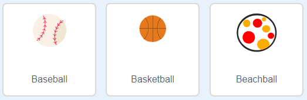

## Dodging balls

Now that you've got your character moving around, let's add some balls for your character to avoid.

--- task ---

Create a new ball sprite. You can choose any type of ball you like.



--- /task ---

--- task ---

Resize your ball, so that your character can jump over it. Try jumping over the ball to test it. 


--- /task ---

--- task ---

Add this code to your ball

:

```blocks
when green flag clicked
hide
forever 
  wait (3) secs
  create clone of [myself v]
end
```

```blocks
when I start as a clone
go to x: (160) y: (160)
show
repeat (22) 
  change y by (-4)
end
repeat (170) 
  change x by (-2)
  turn ccw (6) degrees
end
repeat (30) 
  change y by (-4)
end
delete this clone
```

This code creates a new ball clone every 3 seconds. Each new clone moves along the top platform and then drops.

--- /task ---

--- task ---

Click the flag to test this out.


--- /task ---

--- task ---

Add more code to your ball sprite, so that they move across all 3 platforms.


--- hints ---

--- hint ---

Repeat the code above changing the x{:class="blockmotion"}, y{:class="blockmotion"} and repeat{:class="blockcontrol"} numbers so the balls follow the platforms.

--- /hint ---

--- hint ---

These blocks of code will move the ball in the right directions but will need to be order correctly.

repeat (170) 
  change x by (-2)
  turn ccw (6) degrees
end

repeat (180) 
  change x by (2)
  turn cw (6) degrees
end

repeat (30) 
  change y by (-4)
end

--- /hint ---

--- hint ---

The code for your ball should look like this:

```blocks
when I start as a clone
go to x: (160) y: (160)
show
repeat (22) 
  change y by (-4)
end
repeat (170) 
  change x by (-2)
  turn ccw (6) degrees
end
repeat (30) 
  change y by (-4)
end
repeat (180) 
  change x by (2)
  turn cw (6) degrees
end
repeat (30) 
  change y by (-4)
end
repeat (170) 
  change x by (-2)
  turn ccw (6) degrees
end
delete this clone
```

--- /hint ---

--- /hints ---


--- /task ---

--- task ---

Finally, you'll need code for when your character gets hit by a ball! Add this code to your ball sprite:


```blocks
	when I start as a clone
	forever
		if < touching [Pico walking v]? > then
			broadcast [hit v]
		end
	end
```

--- /task ---

--- task ---

You'll also need to add code to your character, to move back to the start when they're hit:


```blocks
	when I receive [hit v]
	point in direction (90 v)
	go to x: (-210) y: (-120)
```	

--- /task ---

--- task ---

Test out your character and see if they go back to the start when they've been hit by a ball.

--- /task ---

