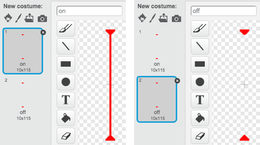

## Lasers!

Let's make your game a little harder to complete, by adding lasers!


+ Add a new sprite to your game, called 'Laser'. It should have 2 costumes, called 'on' and 'off'.

	

+ Place your new laser anywhere you like, between 2 platforms.

	

+ Add code to your laser, to make it switch between the 2 costumes.

	```blocks
		when flag clicked
		forever
			switch costume to [on v]
			wait (2) secs
			switch costume to [off v]
			wait (2) secs
		end
	```

	If you prefer, you can `wait`{:class="blockcontrol"} a `random`{:class="blockoperators"} amount of time between costume changes.

+ Finally, add code to your laser, so that the 'hit' message is broadcast when the laser touches your character. This code will be very similar to the code you added to your ball sprite.

	You don't need to add any more code to your character - it already knows what to do when it is hit!

+ Test out your game to see if you can get past the laser. Change the `wait`{:class="blockcontrol"} times in your code if the lasers are too easy or too hard.

