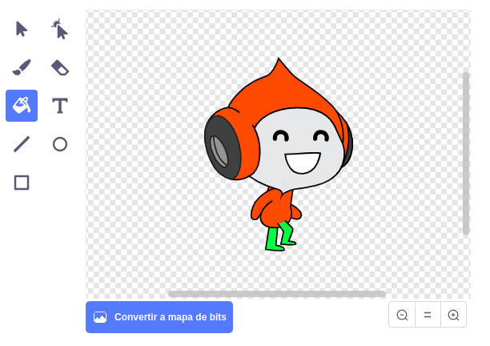

## Desafío: Mejorando la gravedad

Hay otro pequeño fallo en el juego: la gravedad no hace caer al personaje si **alguna** parte del objeto está tocando una plataforma azul. Así que incluso si la cabeza del objeto toca una plataforma, ¡no se cae! Puedes probarlo tú mismo: haz que tu personaje suba la mayor parte del camino por una escalera y luego mueve al personaje de lado debajo de una plataforma:


Para corregir el error primero debes darle a tu objeto de personaje unos nuevos pantalones que tengan un color diferente (en **todos** los disfraces).



Luego cambia este bloque de código:

```blocks3
    < tocando el color [# 0000FF]? >
```

por éste:

```blocks3
    < ¿color [# 00FF00] tocando [# 0000FF]? >
```

¡Para asegurarte de haber solucionado el error prueba el juego después de haber hecho los cambios!