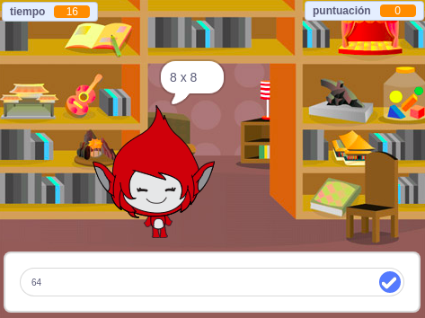

## ¿Qué sigue?

Prueba nuestro proyecto [Juego Mental](https://projects.raspberrypi.org/es-ES/projects/brain-game?utm_source=pathway&utm_medium=whatnext&utm_campaign=projects), en el que puedes crear tu propio test de matemáticas.

--- no-print ---

Haz clic en el botón para iniciar el proceso de pago. Escribe la respuesta a la pregunta y luego pulsa <kbd>Enter</kbd>.

  <iframe allowtransparency="true" width="485" height="402" src="https://scratch.mit.edu/projects/embed/350715825/?autostart=false" frameborder="0" scrolling="no"></iframe>
  

--- /no-print ---

--- print-only ---

--- /print-only ---

***
Traducción aportada por la comunidad

Este proyecto fue traducido por Pablo Collado y revisado por Laura Lurati.

Nuestros increíbles voluntarios de traducción nos ayudan a dar a los niños de todo el mundo la oportunidad de aprender a programar. Puedes ayudarnos a llegar a más niños traduciendo nuestros proyectos. Consigue más información en [rpf.io/translate](https://rpf.io/translate).