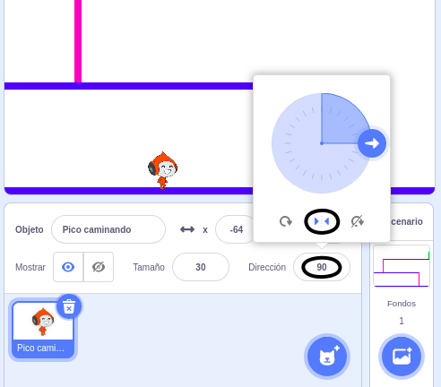

## Movimiento del personaje

Comienza por crear un personaje que pueda moverse hacia la izquierda, la derecha y que pueda subir escaleras.

--- task ---

Abre el proyecto inicial de Scratch 'Esquiva-pelotas'.

**En línea:** abre el proyecto inicial en [rpf.io/dodgeball-on](http://rpf.io/dodgeball-on){:target="_blank"}.

Si tienes una cuenta de Scratch puedes hacer una copia haciendo clic en **Remix**.

**Sin conexión:** descarga el proyecto inicial desde [rpf.io/p/es-ES/dodgeball-get](http://rpf.io/p/es-ES/dodgeball-get) y luego ábrelo con el editor de Scratch sin conexión.

--- /task ---

El proyecto contiene un fondo con plataformas:


--- task ---

Elige un nuevo objeto como el personaje que controlará el jugador y añádelo a tu proyecto. Es mejor si eliges un objeto con varios disfraces de modo que puedas hacer que parezca que está caminando.


[[[generic-scratch3-sprite-from-library]]]

--- /task ---

--- task ---

Añade bloques de código a tu objeto de personaje para que el jugador pueda usar las teclas de dirección para mover al personaje. Cuando el jugador presiona la flecha derecha, el personaje debe apuntar a la derecha, moverse unos pasos y cambiar al siguiente disfraz:


```blocks3
when flag clicked
por siempre 
  si <¿tecla (flecha derecha v) presionada? > entonces
        apuntar en dirección (90 v)
        mover (3) pasos
        siguiente disfraz
    end
end
```

--- /task ---

--- task ---

Si tu objeto no encaja, ajusta su tamaño.


--- /task ---

--- task ---

Prueba tu personaje haciendo clic en la bandera y luego pulsando la tecla de flecha derecha. ¿Se mueve tu personaje a la derecha? ¿Parece que tu personaje está caminando?


--- /task ---

--- task ---

Añade bloques de código al bucle `por siempre`{:class="block3control"} del objeto de personaje para que se desplace hacia la izquierda si se pulsa la tecla de flecha izquierda.

--- hints ---


--- hint ---

Para que tu personaje pueda moverse hacia la izquierda, deberás incluir otro bloque `si`{:class="block3control"} dentro del bucle `por siempre`{:class="block3control"}. Añade código al nuevo bloque `si`{:class="block3control"}, para hacer que el objeto de personaje se `mueva`{:class="block3motion"} hacia la izquierda.

--- /hint ---

--- hint ---

Copia el código que creaste para que el personaje caminara hacia la derecha. Después, cambia la tecla del bloque `presionada`{:class="block3sensing"} a la `flecha izquierda`{:class="block3sensing"}, y establece una `dirección`{:class="block3motion"} de `-90`.

```blocks3
if <key (flecha derecha v) pressed? > then
    apuntar en dirección (90 v)
    mover (3) pasos
    siguiente disfraz
end
```

--- /hint ---

--- hint ---

Tu código debería verse así:


```blocks3
when green flag clicked
forever 
  if <key (flecha derecha v) pressed?> then 
    point in direction (90 v)
    move (3) steps
    next costume
  end
  if <key (flecha izquierda v) pressed?> then 
    point in direction (-90 v)
    move (3) steps
    next costume
  end
end
```

--- /hint ---

--- /hints ---

--- /task ---

--- task ---

Prueba tu nuevo código para asegurarte de que funciona. ¿Tu personaje se pone de cabeza al caminar hacia la izquierda?


Si es así, puedes solucionarlo haciendo clic en la **dirección** de tu objeto de personaje y luego hacer clic en la flecha izquierda-derecha.



Si lo prefieres, también puedes solucionar el problema añadiendo este bloque al inicio del programa del personaje:

```blocks3
fijar estilo de rotación a [izquierda-derecha v]
```

--- /task ---

--- task ---

Para subir una escalera rosa, el objeto de tu personaje debe moverse unos pasos hacia arriba en el escenario cada vez que se presiona la flecha hacia arriba **y** el personaje está tocando el color correcto.

Añade código dentro del bucle `por siempre`{:class="block3control"} del personaje para `cambiar`{:class="block3motion"} la posición `y` (vertical) del mismo `si`{:class="block3control"} `la flecha arriba está presionada`{:class="block3sensing"} y el personaje está `tocando el color rosa`{:class="block3sensing"}.


```blocks3
  if < <key (flecha arriba v) pressed?> and <touching color [#FF69B4]?> > then
		change y by (4)
	end
```

--- /task ---

--- task ---

Prueba tu código. ¿Puedes hacer que el personaje suba las escaleras rosas y llegue al final del nivel?


--- /task ---