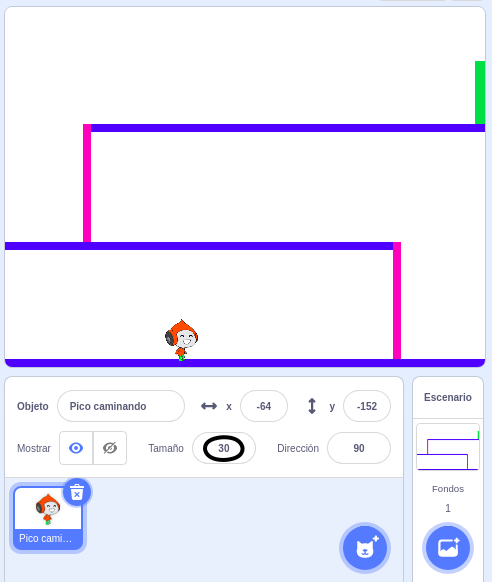

## Movimientos del personaje

Comience por crear un personaje que pueda moverse hacia la izquierda y hacia la derecha, y que pueda subir escaleras.

\--- task \---

Abra el proyecto de arranque de Scratch 'Dodgeball'.

**En línea:** abra el proyecto de inicio en [rpf.io/dodgeball-on](http://rpf.io/dodgeball-on){: target = "_ blank"}.

Si tiene una cuenta de Scratch, puede hacer una copia haciendo clic en **Remix**.

**Desconectado:** de descargar el proyecto inicial de [rpf.io/p/en/dodgeball-get](http://rpf.io/p/en/dodgeball-get) y luego abrirlo con el editor fuera de línea.

\--- /task \---

El proyecto contiene un telón de fondo con plataformas:


\--- task \---

Elige un nuevo sprite como el personaje que controlará el jugador y agrégalo a tu proyecto. Es mejor si eliges un sprite con varios disfraces, de modo que puedas hacer que parezca que está caminando.


[[[generic-scratch3-sprite-from-library]]]

\--- /task \---

\--- task \---

Agrega bloques de código a tu sprite de personaje para que el jugador pueda usar las teclas de flecha para mover al personaje. Cuando el jugador presiona la flecha derecha, el personaje debe apuntar a la derecha, moverse unos pasos y cambiar al siguiente disfraz:


```blocks3
cuando la bandera hace clic en
para siempre
    si se presiona la tecla <(flecha derecha v)? > luego
        punto en la dirección (90 v)
        mover (3) pasos
        siguiente disfraz
    final
final
```

\--- /task \---

\--- task \---

Si tu sprite no encaja, ajusta su tamaño.



\--- /task \---

\--- task \---

Prueba tu personaje haciendo clic en la bandera y luego presionando la tecla de flecha derecha. ¿Tu personaje se mueve hacia la derecha? ¿Parece tu personaje que está caminando?


\--- /task \---

\--- task \---

Agregue bloques de código al bucle `para siempre del carácter sprite`{: class = "block3control"} para que se desplace hacia la izquierda si se presiona la tecla de flecha izquierda.

\--- hints \---

\--- hint \---

Para que tu personaje pueda moverse hacia la izquierda, deberás agregar otro `si`{: class = "block3control"} bloquea dentro del bucle `para siempre`{: class = "block3control"}. En este nuevo `si el bloque`{: class = "block3control"}, agregue el código para hacer que su personaje sprite `mueva`{: class = "block3motion"} a la izquierda.

\--- /hint \---

\--- hint \---

Copia el código que creaste para que el personaje gire a la derecha. Luego, establezca la tecla `presionada`{: class = "block3sensing"} en la flecha izquierda ``{: class = "block3sensing"}, y cambie `direcciones`{: class = "block3motion"} a `-90`.

```blocks3
Si se presiona la tecla <(flecha derecha v)? > luego
    punto en la dirección (90 v)
    mover (3) pasos
    siguiente disfraz
final
```

\--- /hint \---

\--- hint \---

Tu código debería tener este aspecto ahora:


```blocks3
cuando la bandera verde hizo clic en
para siempre 
  si <key (right arrow v) pressed?> luego 
    puntos en la dirección (90 v)
    movimientos (3) pasos
    siguiente traje
  final
  si <key (left arrow v) pressed?> luego 
    puntos en la dirección (-90 v)
    movimientos (3) pasos
    siguientes traje
  final
final
```

\--- /hint \---

\--- /hints \---

\--- /task \---

\--- task \---

Pruebe su nuevo código para asegurarse de que funciona. ¿Tu personaje se pone de cabeza al caminar hacia la izquierda?


Si es así, puede solucionar este problema haciendo clic en el **dirección** de tu sprite carácter, y luego hacer clic en la flecha izquierda-derecha.


O si lo prefiere, también puede solucionar el problema agregando este bloque al inicio de la secuencia de comandos de su personaje:

```blocks3
establecer estilo de rotación [izquierda-derecha v]
```

\--- /task \---

\--- task \---

Para subir una escalera rosa, el sprite de tu personaje debe moverse unos pasos hacia arriba en el escenario cada vez que se presiona la flecha hacia arriba **y** el personaje está tocando el color correcto.

Agregue dentro del bucle `su personaje para siempre`{: clase = "control de bloque"} al cambio ``{: clase = "movimiento de bloque"} posición `y` (vertical) del carácter `si`{: clase = "control de bloque"} el `la flecha hacia arriba se presiona`{: class = "block3sensing"} y el carácter es `tocando el color rosa`{: class = "block3sensing"}.


```blocks3
    si < <key (up arrow v) pressed?> y <touching color [#FF69B4]?> > entonces
        cambian y por (4)
    final
```

\--- /task \---

\--- task \---

Pon a prueba tu código. ¿Puedes hacer que el personaje suba las escaleras rosadas y llegue al final del nivel?


\--- /task \---