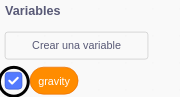

## Gravedad y saltos

Ahora vas a hacer que tu personaje se mueva de forma más realista: agregarás gravedad a tu juego y le darás al personaje la capacidad de saltar.

\--- task \---

En el juego, mueve a tu personaje para que se caiga de una plataforma. ¿Ves que puede caminar sin tener nada bajo sus pies?


\--- /task \---

\--- task \---

Para arreglar esto, añade la gravedad a tu juego. Para hacerlo crea una nueva variable llamada `gravedad`{:class="block3variables"}.

[[[generic-scratch3-add-variable]]]

Puedes ocultar esta variable para que no salga en el escenario si quieres.



\--- /task \---

\--- task \---

Añade estos nuevos bloques de código que fijan la `gravedad` a un número negativo y usa el valor de `gravedad` para cambiar repetidamente la coordenada y de tu personaje:


```blocks3
    al hacer clic en la bandera verde
    dar a [gravedad v] el valor [-4]
    por siempre
        sumar a y (gravedad)
    final
```

\--- /task \---

\--- task \---

Haz clic en la bandera y después arrastra al personaje a la parte superior del escenario. ¿Qué pasa? ¿Funciona la gravedad como esperabas?


\--- /task \---

\--- task \---

¡La gravedad no debe mover al objeto de personaje a través de una plataforma o una escalera! Añade un bloque `si`{:class="block3control"} a tu código para que la gravedad solo funcione cuando el personaje esté en el aire. El código de gravedad debería parecerse a éste:


```blocks3
    al hacer clic en la bandera verde
    dar a [gravedad v] el valor [-4]
    por siempre
        si < no < <touching color [#0000FF]?> o <touching color [#FF69B4]?> > > entonces
            sumar a y (gravedad)
        final
    final
```

\--- /task \---

\--- task \---

Prueba el juego de nuevo para ver si la gravedad funciona correctamente ahora. ¿Deja el personaje de caer cuando toca una plataforma o una escalera? ¿Puedes hacer que el personaje se salga del borde de las plataformas y caiga al nivel inferior?


\--- /task \---

\--- task \---

Ahora añade código para hacer que tu personaje salte cada vez que el jugador presione la tecla <kbd>espacio</kbd>. Una manera muy fácil de hacer esto es mover a tu personaje varias veces:


```blocks3
    cuando se presiona la tecla [espacio v]
    repetir (10)
        sumar a y (4)
    final
```

Debido a que la gravedad empuja constantemente a tu personaje hacia abajo 4 píxeles, debes elegir un número mayor que `4` en tus bloques `sumar a y (4)`{:class="block3motion"}. Cambia el número hasta que estés satisfecho con la altura que salta el personaje.

\--- /task \---

\--- task \---

Prueba tu código. Fíjate en que el movimiento de salto no es muy suave. Para hacer que los saltos sean más suaves, debes mover el objeto de personaje en cantidades cada vez más pequeñas hasta que no suba más.

\--- /task \---

\--- task \---

Para hacerlo crea una nueva variable llamada `altura del salto`{:class="block3variables"}. Una vez más, puedes ocultarla si lo prefieres.

\--- /task \---

\--- task \---

Elimina el código de salto que añadiste a tu personaje, y cámbialo por éste:


```blocks3
    cuando se presiona la tecla [espacio v]
    dar a [altura de salto v] el valor [8]
    repetir hasta que < (altura de salto) = [0] >
        suamr a y (altura de salto)
        sumar a [altura de salto v] (-0.5)
    final
```

Este código hace que tu personaje suba 8 píxeles, luego 7.5 píxeles, luego 7 píxeles, y así sucesivamente, hasta que no suba más. Ésto hace que el salto sea mucho más suave.

\--- /task \---

\--- task \---

Cambia el valor de la variable `altura del salto`{:class="block3variables"} que se fija antes de que comience el bloque `repetir`{:class="block3control"}. Después prueba tu juego.

Repite estos dos pasos hasta que estés satisfecho con la altura con la que salta el personaje.

\--- /task \---