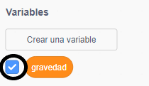

## Gravedad y saltos

Ahora vas a hacer que tu personaje se mueva de forma más realista: agregarás gravedad a tu juego y le darás la capacidad de saltar.

\--- task \---

En el juego, mueve a tu personaje para que salga de una plataforma. ¿Ves que puede caminar en el espacio vacío?


\--- /task \---

\--- task \---

Para arreglar esto, agrega gravedad a tu juego. Para hacer esto, crea una nueva variable llamada gravedad ``{: class = "block3variables"}.

[[[generic-scratch3-add-variable]]]

Puede ocultar esta variable de su escenario si lo desea.



\--- /task \---

\--- task \---

Agrega estos nuevos bloques de código que establecen `gravedad` en un número negativo y usa el valor de `gravedad` para cambiar repetidamente la coordenada y de tu personaje:


```blocks3
    cuando se hace clic en el indicador
    establezca [gravedad v] en [-4]
    para siempre
        cambie y por (gravedad)
    final
```

\--- /task \---

\--- task \---

Haga clic en la bandera y luego arrastre su personaje hasta la parte superior del escenario. ¿Lo que pasa? ¿Funciona la gravedad como esperas?


\--- /task \---

\--- task \---

¡La gravedad no debe mover el personaje sprite a través de una plataforma o una escalera! Agrega un `si`{: class = "block3control"} bloque a tu código para que la gravedad solo funcione cuando el personaje esté en el aire. El código de gravedad debería verse así:


```blocks3
    cuando se hace clic en el indicador
    establezca [gravedad v] en [-4]
    para siempre
        si < no < <touching color [#0000FF]?> o <touching color [#FF69B4]?> > > luego
            cambia y por (gravedad)
        final
    final
```

\--- /task \---

\--- task \---

Prueba el juego de nuevo para ver si la gravedad funciona correctamente ahora. ¿Su sprite de personaje deja de caer cuando toca una plataforma o una escalera? ¿Puedes hacer que el personaje se salga del borde de las plataformas y caiga al nivel inferior?


\--- /task \---

\--- task \---

Ahora agregue un código para hacer que su personaje salte cada vez que el jugador presione la tecla <kbd>espacio</kbd>. Una manera muy fácil de hacer esto es mover a tu personaje varias veces:


```blocks3
    cuando se presiona la tecla [espacio v]
    repetición (10)
        cambia y por (4)
    fin
```

Debido a que la gravedad empuja constantemente a tu personaje hacia abajo en 4 píxeles, debes elegir un número mayor que `4` en tus `cambios y por (4)`{: class = "block3motion"} block. Cambia el número hasta que estés satisfecho con la altura que salta el personaje.

\--- /task \---

\--- task \---

Prueba tu código. Observe que el movimiento de salto no es muy suave. Para hacer que los saltos se vean más suaves, debes mover tu personaje sprite en cantidades cada vez más pequeñas, hasta que no suba más.

\--- /task \---

\--- task \---

Para hacer esto, crea una nueva variable llamada `jump height`{: class = "block3variables"}. Una vez más, puede ocultar esta variable si lo prefiere.

\--- /task \---

\--- task \---

Elimina el código de salto que agregaste a tu personaje sprite, y agrega este código en su lugar:


```blocks3
    cuando se presiona la tecla [espacio v]
    ajuste [altura de salto v] a [8]
    repita hasta que < (altura de salto) = [0] >
        cambie y por (altura de salto)
        cambie [altura de salto v] por (-0.5)
    final
```

Este código hace que tu personaje suba 8 píxeles, luego 7.5 píxeles, luego 7 píxeles, y así sucesivamente, hasta que no suba más. Esto hace que el salto se vea mucho más suave.

\--- /task \---

\--- task \---

Cambiar el valor del `altura del salto`{: class = "block3variables"} variable que se establece antes de que el `de repetición`{: class = "block3control"} comienza. Entonces prueba tu juego.

Repite estos dos pasos hasta que estés satisfecho con la altura con la que salta el personaje.

\--- /task \---