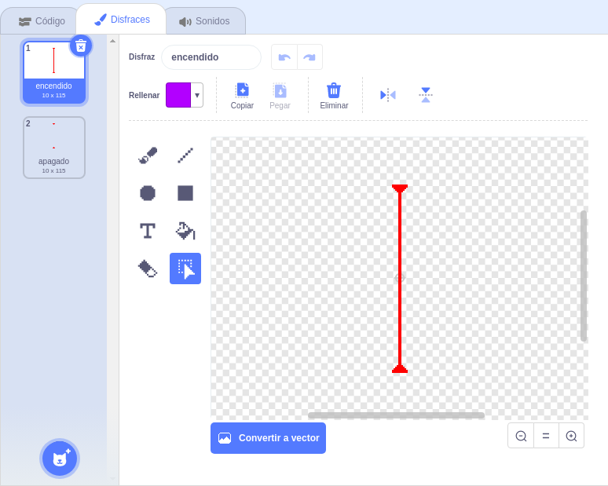
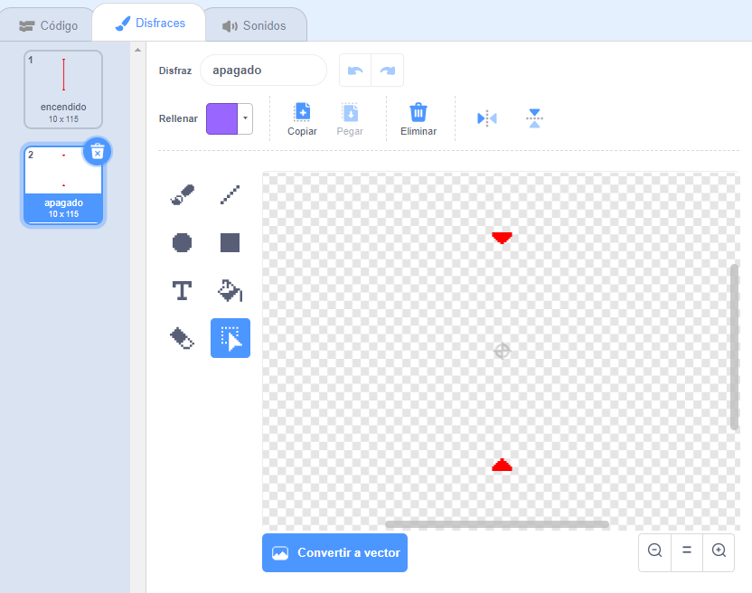

## ¡Láseres!

¡Vamos a añadir láseres para que tu juego sea un poco más difícil!

\--- task \---

Agrega un nuevo objeto a tu juego y llámalo `láser`. Debe tener dos disfraces: uno llamado 'encendido' y otro llamado 'apagado'.





\--- /task \---

\--- task \---

Coloca tu nuevo objeto láser entre dos plataformas.


\--- /task \---

\--- task \---

Añade código a tu objeto láser para que cambie entre sus dos disfraces.


```blocks3
    al hacer clic en la bandera verde
    por siempre
        cambiar disfraz a (encendido v)
        esperar (2) segundos
        cambie disfraz a (apagado v)
        esperar (2) segundos
    final
```

Puedes cambiar el código que se muestra arriba para que el sprite `espere`{:class="block3control"} una cantidad de tiempo `aleatoria`{:class="block3operators"} entre los cambios de disfraz.

\--- /task \---

\--- task \---

Finalmente, añade código a tu objeto láser para que emita el mensaje "tocado" cuando toque el obejto de personaje.

\--- hints \---

\--- hint \---

Este código debe ser muy parecido al código que añadiste al objeto pelota.

\--- /hint \---

\--- hint \---

Copia el código que añadiste a la pelota para hacer que el obejto `enviara`{:class="block3control"} el mensaje `'tocado'`{:class="block3control"} cuando <0>tocara a tu personaje</0>{:class="block3sensing"}.

\--- /hint \---

\--- hint \---

Este es el código que debes incluir:


```blocks3
al hacer clic en la bandera verde
por siempre 
  si <touching (Pico walking v) ?> entonces 
    enviar (tocado v)
  final
final
```

\--- /hint \---

\--- /hints \---

No tienes que añadir ningún bloque adicional a tu objeto de personaje porque ¡ya sabe qué hacer cuando recibe el mensaje `'tocado'`{:class="block3control"}!

\--- /task \---

\--- task \---

Prueba tu juego para ver si puedes mover al personaje más allá del láser. Si el láser es demasiado fácil o difícil de evitar, cambiar el tiempo de `espera`{:class="block3control"} en el código del objeto láser.

\--- /task \---