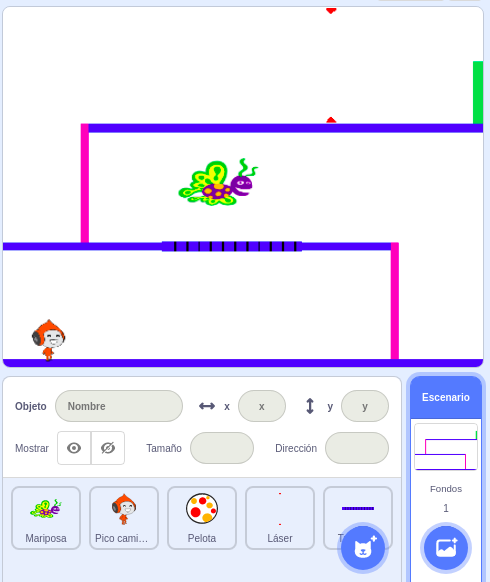

\--- challenge \---

## Challenge: More obstacles

If you think your game is still too easy, you can add more obstacles to your level. You can add anything you like, but here are some ideas:

+ A flying killer butterfly;
+ Platforms that appear and disappear;
+ Falling tennis balls that must be avoided.



You could even create more than one backdrop, and move to the next level when your character reaches the green door:

```blocks
    if <touching color [#00FF00]?> then
        switch backdrop to [next backdrop v]
        go to x: (-210) y: (-120)
        wait (1) secs
    end
```

\--- /challenge \---