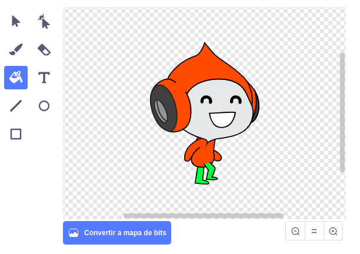

## Desafío: Mejorando la gravedad

Hay otro pequeño fallo en tu juego: la gravedad no hace caer al personaje si **alguna** parte del objeto está tocando la plataforma azul. Así que incluso si la cabeza del objeto toca una plataforma, ¡no se cae! Puedes probarlo tú mismo: haz que tu personaje suba la mayor parte del camino por una escalera y luego mueve al personaje a un lado debajo de una plataforma:


Para corregir el error, primero debes darle al sprite de tu personaje unos nuevos pantalones que tengan un color diferente (en **todos** los disfraces).



Luego, reemplaza este bloque de código:

```blocks3
    < touching color [#0000FF]? >
```

por este bloque de código:

```blocks3
    < color [#00FF00] is touching [#0000FF]? >
```

¡Para asegurarte de haber solucionado el error, prueba el juego después de haber hecho los cambios!