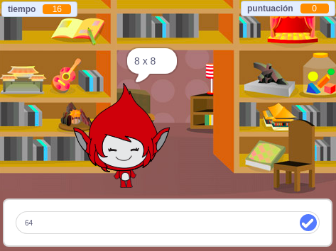

## ¿Qué sigue?

Prueba nuestro proyecto [Juego Mental](https://projects.raspberrypi.org/es-LA/projects/brain-game?utm_source=pathway&utm_medium=whatnext&utm_campaign=projects), en el que puedes crear tu propio examen de matemáticas.

--- no-print ---

Haz clic en el botón para iniciar. Escribe la respuesta a la pregunta y pulsa <kbd>Enter</kbd>.

  <iframe allowtransparency="true" width="485" height="402" src="https://scratch.mit.edu/projects/embed/250234955/?autostart=false" frameborder="0" scrolling="no"></iframe>
  

--- /no-print ---

--- print-only ---

--- /print-only ---

***
Este proyecto fue traducido por voluntarios:

Antonella del Rocio Oblitas Ilizarbe

Mauricio Gonzales Nacarino

Joel Santisteban Vargas

Gracias a los voluntarios, podemos dar a las personas de todo el mundo la oportunidad de aprender en su propio idioma. Puedes ayudarnos a llegar a más personas ofreciéndote como voluntario para traducir. Más información en [rpf.io/translate](https://rpf.io/translate).