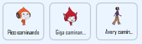
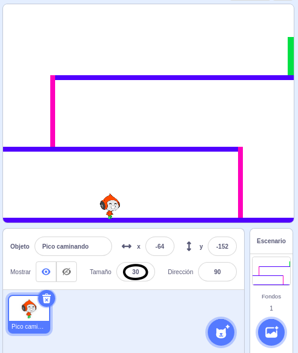
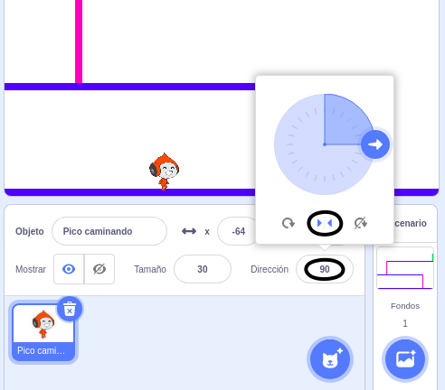

## Movimiento del personaje

Comienza creando un personaje que pueda moverse hacia la izquierda y derecha, y que pueda subir las escaleras.

--- función ---

Abre el proyecto inicial de Scratch "Quemados".

**En línea**: abra un nuevo proyecto Scratch en línea en [rpf.io/dodgeball-on](http://rpf.io/dodgeball-on).

Si tiene una cuenta de Scratch, puede hacer una copia haciendo clic en **Remix**.

**Sin conexión:** descarga el proyecto inicial desde [rpf.io/p/es-LA/dodgeball-get](http://rpf.io/p/es-LA/dodgeball-get) y luego ábrelo con el editor de Scratch fuera de linea.

--- /task ---

El proyecto contiene un fondo con plataformas:


--- task ---

Selecciona un nuevo objeto como el personaje que controlará el jugador y añádelo a tu proyecto. Es mejor si eliges un objeto con varios disfraces de modo que puedas hacer que parezca que está caminando.



[[[generic-scratch3-sprite-from-library]]]

--- /task ---

--- task ---

Añade bloques de código a tu objeto personaje para que el jugador pueda usar las teclas direccionales para mover al personaje. Cuando el jugador presiona la flecha derecha, el personaje debe apuntar a la derecha, moverse unos pasos y cambiar al siguiente disfraz:


```blocks3
when flag clicked
forever
    if <key (right arrow v) pressed? > then
        point in direction (90 v)
        move (3) steps
        next costume
    end
end
```

--- /task ---

--- task ---

Si tu objeto no encaja, ajusta su tamaño.



--- /task ---

--- task ---

Prueba tu personaje haciendo clic en la bandera y luego pulsando la tecla de la flecha derecha. ¿ Tu personaje se mueve a la derecha? ¿Tu personaje aparece como si estuviera caminando?


--- /task ---

--- task ---

Añade bloques de código al bucle `por siempre` del objeto personaje {:class="block3control"} para que se desplace hacia la izquierda si se presiona la tecla de flecha izquierda.

--- hints ---


--- hint ---

Para que tu personaje pueda moverse hacia la izquierda, deberás incluir otro bloque `si`{:class="block3control"} dentro del bucle `por siempre`{:class="block3control"}. En este nuevo bloque `si`{:class="block3control"}, añade un código para hacer que el objeto personaje se `mueva`{:class="block3motion"} hacia la izquierda.

--- /hint ---

--- hint ---

Copia el código que creaste para hacer que el personaje camine hacia la derecha. Después, establece la `tecla presionada`{:class="block3sensing"} a la `flecha izquierda`{:class="block3sensing"} y cambia la `dirección`{:class="block3motion"} a `-90`.

```blocks3
if <key (right arrow v) pressed? > then
    point in direction (90 v)
    move (3) steps
    next costume
end
```

--- /hint ---

--- hint ---

Tu código debería verse así:


```blocks3
when green flag clicked
forever 
  if <key (right arrow v) pressed?> then 
    point in direction (90 v)
    move (3) steps
    next costume
  end
  if <key (left arrow v) pressed?> then 
    point in direction (-90 v)
    move (3) steps
    next costume
  end
end
```

--- /hint ---

--- /hints ---

--- /task ---

--- task ---

Prueba tu nuevo código para asegurarte de que funciona. ¿Tu personaje se pone de cabeza al caminar hacia la izquierda?


Si es así, puedes solucionarlo haciendo clic en la **dirección** del objeto de tu personaje y luego, haciendo clic en la flecha izquierda-derecha.



O si lo prefieres, también puedes solucionar el problema añadiendo este bloque al inicio del guión de tu personaje:

```blocks3
set rotation style [left-right v]
```

--- /task ---

--- task ---

Para subir la escalera rosada, tu personaje debe moverse unos pasos hacia arriba en el escenario siempre que se presione la flecha hacia arriba **y** el personaje esté tocando el color correcto.

Añade un código dentro del bucle `por siempre`{:class="block3control"} del personaje para `cambiar`{:class="block3motion"} la posición `y` (vertical) del mismo `si`{:class="block3control"} `la flecha hacia arriba está presionada`{:class="block3sensing"} y el personaje está `tocando el color rosado`{:class="block3sensing"}.


```blocks3
    if < <key (up arrow v) pressed?> and <touching color [#FF69B4]?> > then
        change y by (4)
    end
```

--- /task ---

--- task ---

Prueba tu código. ¿Puedes hacer que el personaje suba las escaleras rosadas y llegue al final del nivel?


--- /task ---