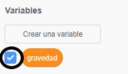

## Gravedad y saltos

Ahora harás que tu personaje se mueva de forma más realista: agregarás gravedad a tu juego y le darás al personaje la capacidad de saltar.

--- task ---

En el juego, mueve tu personaje para que se caiga de una plataforma. ¿Ves que puede caminar hacia un espacio vacío?


--- /task ---

--- task ---

Para arreglar esto, añade gravedad a tu juego. Para hacerlo, crea una nueva variable llamada `gravedad`{:class="block3variables"}.

[[[generic-scratch3-add-variable]]]

Si quieres, puedes ocultar esta variable para que no salga en el escenario.



--- /task ---

--- task ---

Añade estos nuevos bloques de código que fijan la `gravedad` a un número negativo y usa el valor de `gravedad` para cambiar repetidamente la coordenada y de tu personaje:


```blocks3
    when flag clicked
    set [gravedad v] to [-4]
    forever
        change y by (gravedad)
    end
```

--- /task ---

--- task ---

Haz clic en la bandera y después arrastra tu personaje a la parte superior del escenario. ¿Qué pasa? ¿La gravedad funciona como esperabas?


--- /task ---

--- task ---

¡La gravedad no debería mover al objeto del personaje a través de una plataforma o una escalera! Añade un bloque `si`{:class="block3control"} a tu código para que la gravedad solo funcione cuando el personaje esté en el aire. El código de gravedad debería verse así:


```blocks3
    when flag clicked
    set [gravedad v] to [-4]
    forever
        if < not < <touching color [#0000FF]?> or <touching color [#FF69B4]?> > > then
            change y by (gravedad)
        end
    end
```

--- /task ---

--- task ---

Prueba el juego de nuevo para ver si ahora la gravedad funciona correctamente. ¿El personaje deja de caer cuando toca una plataforma o una escalera? ¿Puedes hacer que el personaje se salga del borde de las plataformas y caiga al nivel inferior?


--- /task ---

--- task ---

Ahora añade un código para hacer que tu personaje salte cada vez que el jugador presione la tecla <kbd>espacio</kbd>. Una manera muy fácil de hacer esto, es moviendo a tu personaje hacia arriba varias veces:


```blocks3
    when [space v] key pressed
    repeat (10)
        change y by (4)
    end
```

Debido a que la gravedad jala constantemente a tu personaje por 4 píxeles, debes elegir un número mayor que `4` en tus bloques `sumar a y (4)`{:class="block3motion"}. Cambia el número hasta que estés satisfecho con la altura a la que salta el personaje.

--- /task ---

--- task ---

Prueba tu código. Fíjate que el movimiento del salto no sea muy fluido. Para hacer que los saltos sean más fluidos, debes mover el objeto de tu personaje en cantidades cada vez más pequeñas hasta que no suba más.

--- /task ---

--- task ---

Para hacerlo, crea una nueva variable llamada `altura del salto`{:class="block3variables"}. Una vez más, puedes ocultarla si lo prefieres.

--- /task---

--- task ---

Elimina el código de salto que añadiste a tu personaje, y cámbialo por este:


```blocks3
    when [space v] key pressed
    set [altura del salto v] to [8]
    repeat until < (altura del salto) = [0] >
        change y by (altura del salto)
        change [altura del salto v] by (-0.5)
    end
```

Este código hace que tu personaje suba a 8 píxeles, luego a 7.5 píxeles, luego a 7 píxeles y así, sucesivamente, hasta que no suba más. Esto hace que el salto sea mucho más fluido.

--- /task---

--- task ---

Cambia el valor de la variable `altura del salto`{:class="block3variables"} que se fija antes de que comience el bloque `repetir`{:class="block3control"}. Después prueba tu juego.

Repite estos dos pasos hasta que estés satisfecho con la altura con la que salta el personaje.

--- /task---