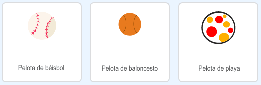

## Esquivando las pelotas

Ahora, tu personaje puede moverse y saltar, por lo que es hora de agregar algunas pelotas que el personaje tendra que esquivar.

--- task ---

Crea un nuevo objeto llamado pelota. Puedes elegir cualquier tipo de pelota que te guste.



--- /task ---

--- task ---

Cambia el tamaño del objeto "pelota" para que el personaje puede saltar sobre ella. Intenta hacer que el personaje salte sobre la pelota para comprobar si tiene el tamaño correcto.


--- /task ---

--- task ---

Añade este código al objeto "pelota":


```blocks3
when green flag clicked
hide
forever 
  wait (3) seconds
  create clone of (myself v)
end
```

```blocks3
when I start as a clone
go to x: (160) y: (160)
show
repeat (22) 
  change y by (-4)
end
repeat (170) 
  change x by (-2)
  turn ccw (6) degrees
end
repeat (30) 
  change y by (-4)
end
delete this clone
```

Este código crea un nuevo clon del objeto "pelota" cada tres segundos. Cada nuevo clon se mueve a lo largo de la plataforma superior y luego cae.

--- /task---

--- task ---

Haz clic en la bandera para probar el juego.


--- /task ---

--- task ---

Añade más código al objeto pelota para que los clones se muevan por las tres plataformas.


--- hints ---

--- hint ---

Repite los bloques de código que has usado para mover el clon del objeto pelota por la primera plataforma. Debes cambiar `x`{:class="block3motion"}, `y`{:class="block3motion"} y `repetir`{:class="block3control"} los números para que los clones sigan en las plataformas correctamente.

--- /hint ---

--- hint ---

Estos son los bloques que necesitas. Asegúrate de colocarlos en el orden correcto.


```blocks3
repeat (170) 
  change x by (-2)
  turn ccw (6) degrees
end

repeat (180) 
  change x by (2)
  turn cw (6) degrees
end

repeat (30) 
  change y by (-4)
end
```

--- /hint ---

--- hint ---

El código de tus clones del objeto pelota debería ser algo así:


```blocks3
when I start as a clone
go to x: (160) y: (160)
show
repeat (22) 
  change y by (-4)
end
repeat (170) 
  change x by (-2)
  turn ccw (6) degrees
end
repeat (30) 
  change y by (-4)
end
repeat (180) 
  change x by (2)
  turn cw (6) degrees
end
repeat (30) 
  change y by (-4)
end
repeat (170) 
  change x by (-2)
  turn ccw (6) degrees
end
delete this clone
```

--- /hint ---

--- /hints ---

--- /task ---

--- task ---

¡Ahora añade algunos bloques de código para transmitir (enviar) un mensaje si tu personaje es golpeado por una bola!

Añade este código a tu objeto pelota:


```blocks3
    when I start as a clone
    forever
        if < touching (Pico caminando v)? > then
            broadcast (golpeado v)
        end
    end
```

--- /task---

--- task ---

Finalmente, añade bloques de código al objeto personaje para que vuelva a su posición inicial cuando reciba el mensaje `golpeado`:


```blocks3
    when I receive [golpeado v]
    point in direction (90)
    go to x: (-210) y: (-120)
```

--- /task ---

--- task ---

Prueba tu código. Comprueba si el personaje vuelve al inicio después de tocar una pelota.

--- /task ---